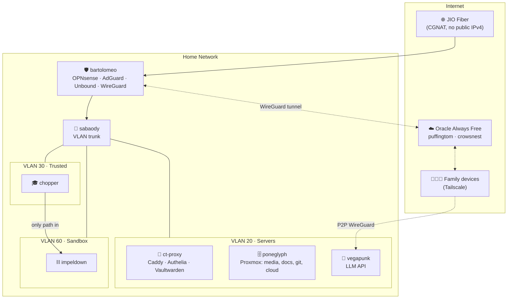

# 🌞 Thousand Sunny ⛵

### A self-hosted homelab that sails the Grand Line of self-hosting — networking, storage, media, local AI, security, and automation, all running from home.

*"I want a homelab that just works — for me, my family, and the people I share it with."*

---

## What is this?

**Thousand Sunny** is the design and documentation for a real, family-scale homelab spread across a two-storey home in India, behind a JIO Fiber (CGNAT) connection. It runs a firewall and DNS, a NAS with a full media/photos/documents stack, **local LLMs served to every device in the house**, monitoring and centralized logging, a cybersecurity + retro-gaming lab, and a set of automations — all self-hosted, with **zero recurring cost** for external access.

Every machine in the fleet is named after **One Piece** — the crew that *is* the ship. This is a **portfolio project**: the docs are written to be read by a stranger and to demonstrate architectural decisions, not just list `docker-compose` files.

> [!NOTE]
> All software versions, model names, and pricing in these docs reflect the **July 2026** landscape. Every service links to its official docs. See [`docs/16-versions.md`](docs/16-versions.md) for the full version matrix.

---

## The Fleet

| Host | Hardware | Role | Detail |
|---|---|---|---|
| 🌐 `loguetown` | JIO Fiber ONT/router | ISP gateway (double-NAT) | The last town before the Grand Line |
| 🛡️ `bartolomeo` | SKULLSAINTS Agni — Intel N150, 16 GB, **dual 2.5 GbE** | Firewall · routing · WireGuard · DNS (AdGuard/Unbound) | The Barrier Man — nothing gets through the wall |
| 🔀 `sabaody` | TP-Link TL-SG108E (8-port smart) | Managed switch / VLAN trunk | The junction archipelago |
| 🔀 `waterseven` | TP-Link TL-SG105E (5-port smart) | Hall VLAN switch — splits the riser | Water Seven — the second junction city |
| 🗄️ `poneglyph` | Minisforum N5 — Ryzen 7 255, 16→32 GB, 512 GB NVMe + 2×4 TB HDD | NAS · media · apps · reverse proxy + SSO (Proxmox) | Indestructible records of history |
| 🧠 `vegapunk` | Core Ultra 265K, **RTX 5070 Ti 16 GB**, 64 GB | LLM inference server (now) | Punk Records — the brain every satellite queries |
| 🎓 `chopper` | Ryzen 7 3700X, RTX 2070 Super, 32 GB | Study / dev / gaming (son's PC) | The crew's youngest, always studying |
| ⛓️ `impeldown` | Beelink SER5 — Ryzen 7 5800H, 16 GB | Cyber sandbox + retro emulation (isolated) | The great prison — nothing escapes |
| ⚡ `pluton` | Ryzen 9800X3D, **AMD R9700 32 GB**, 64 GB *(≈2 months out)* | AI heavy-hitter workstation | The ancient weapon, awaiting awakening |
| 📡 `denden` | TP-Link Archer AC1750 (AP mode) | First-floor Wi-Fi access point | The Den Den Mushi — wireless comms |
| 🚂 `puffingtom` | Oracle Cloud Always Free (ARM) | Public edge / tunnel | The sea train — a fixed route to the outside |
| 🔭 `crowsnest` | Oracle Cloud Always Free (ARM) | External monitoring / status | The lookout post, watching from afar |

Full inventory, limits and upgrade headroom: **[`docs/01-fleet.md`](docs/01-fleet.md)**.

---

## Architecture at a glance

Wiring, VLANs and firewall rules: **[`docs/02-network.md`](docs/02-network.md)**.

---

## Documentation map

| # | Doc | Answers |
|---|---|---|
| 00 | [Overview & principles](docs/00-overview.md) | Goals, design principles, what runs where, recommended additions |
| 01 | [The Fleet](docs/01-fleet.md) | Every machine, its role, **its limitations**, upgrade headroom |
| 02 | [Network & VLANs](docs/02-network.md) | Wiring, VLAN scheme, firewall, DNS names, **sandbox isolation**, remote/SSH access |
| 03 | [Virtualization](docs/03-virtualization.md) | Proxmox layout, **VM vs LXC per service + CPU/RAM/disk table** |
| 04 | [Storage & backup](docs/04-storage.md) | ZFS mirror, NAS-OS decision, 3-2-1 backups |
| 05 | [Core services](docs/05-core-services.md) | OPNsense, AdGuard+Unbound, Caddy, Authelia, Vaultwarden, CrowdSec |
| 06 | [Media stack](docs/06-media-stack.md) | Jellyfin, Seerr, *arr, Usenet, **AllDebrid via Decypharr**, Immich, Kavita, Navidrome |
| 07 | [Productivity](docs/07-productivity.md) | Nextcloud, Paperless-ngx, Forgejo, **Obsidian sync alternatives** |
| 08 | [AI & Local LLMs](docs/08-ai-llm.md) | Models, **Ollama vs llama.cpp vs vLLM**, LiteLLM, Immich/Paperless AI |
| 09 | [Observability](docs/09-observability.md) | Monitoring, dashboards, **centralized logging + LLM anomaly detection** |
| 10 | [External access](docs/10-external-access.md) | CGNAT, **Tailscale + Pangolin/WireGuard, $0 family Jellyfin** |
| 11 | [Security & ops](docs/11-security.md) | Segmentation, secrets, hardening, **patching & upgrade strategy** |
| 12 | [Automation](docs/12-automation.md) | n8n, **Telegram YouTube-toggle**, movie pipeline, family reminders |
| 13 | [impeldown labs](docs/13-impeldown-labs.md) | **Cyber sandbox + retro dual-boot**, is the 5800H enough for emulation? |
| 14 | [Sites & social](docs/14-sites-social.md) | Lakeside booking site ↔ Nextcloud, notes publishing, **honest IG/YT automation** |
| 15 | [Roadmap & shopping](docs/15-roadmap.md) | Phased rollout, **pluton migration**, limitations, India deals |
| 16 | [Version matrix](docs/16-versions.md) | Every service, pinned version, official docs link |

---

### Runnable configs

Beyond the docs, the repo ships runnable, sanitized templates:
- **Per-service Docker stacks** in [`stacks/`](stacks/) (`ct-media`, `ct-photos`, `ct-library`, `ct-cloud`, `ct-automation`, `ct-observe`) — image tags pinned to the [version matrix](docs/16-versions.md) and `mem_limit`/`cpus` matching the [virtualization plan](docs/03-virtualization.md).
- **Edge rebuild kit** in [`deploy/`](deploy/) — cloud-init bootstrap, Ansible roles (`common`/`wireguard`/`caddy`), reference WireGuard/Caddy configs, and a Pangolin+Newt alternative — with two runbooks in [`docs/runbooks/`](docs/runbooks/) that restore the CGNAT-bypass tunnel on any VPS in ~15 minutes.

All values are sanitized templates; secrets stay in Vaultwarden/SOPS (`.env` is git-ignored).

## Design principles

1. **Isolate by default.** Every trust boundary is a VLAN and a firewall rule, not a hope. The cyber sandbox is a dead-end; IoT can't see your laptops.
2. **No recurring cost for reach.** CGNAT is beaten with a free Oracle VPS + WireGuard and Tailscale — not a paid tunnel.
3. **Own the intelligence.** LLMs run on hardware you own; no tokens leave the house. Immich and Paperless get smarter using the same GPU.
4. **Everything has a name, not an IP.** Split-horizon DNS + a reverse proxy means `jellyfin.sunny.home`, never `10.10.20.14:8096`.
5. **Boring where it counts.** ZFS mirror, 3-2-1 backups, staged upgrades, and centralized logs — the unglamorous parts are the portfolio.
6. **Honest about limits.** Where the hardware or the ISP says no (PS4 emulation on an iGPU, Cloudflare + Jellyfin, 16 GB for ZFS), the docs say so.

---

## Status

🟡 **In build.** Phase 1 (network + Proxmox + core services) first; `pluton` migration folds in when the 9800X3D/R9700 lands (~2 months). See the [roadmap](docs/15-roadmap.md).

> [!IMPORTANT]
> **Day-0 blocking prerequisites** (do *before* go-live, not "someday"):
> 1. **`poneglyph` → 32 GB RAM** — 16 GB cannot safely run ZFS ARC + ~20 containers ([why](docs/03-virtualization.md)).
> 2. **2nd 4 TB IronWolf → ZFS mirror** — the single drive has zero redundancy ([why](docs/04-storage.md)).
> 3. **`waterseven` hall switch** before `impeldown` goes live — its VLAN isolation depends on it ([why](docs/02-network.md)).
>
> This design was **independently reviewed**; see [`CHANGELOG.md`](CHANGELOG.md) for the v1.1 hardening pass (tunnel-failover, backup encryption, config-backup automation).

Built as a portfolio project. Fleet named after <a href="https://en.wikipedia.org/wiki/One_Piece">One Piece</a>. No affiliation with Toei/Shueisha.

