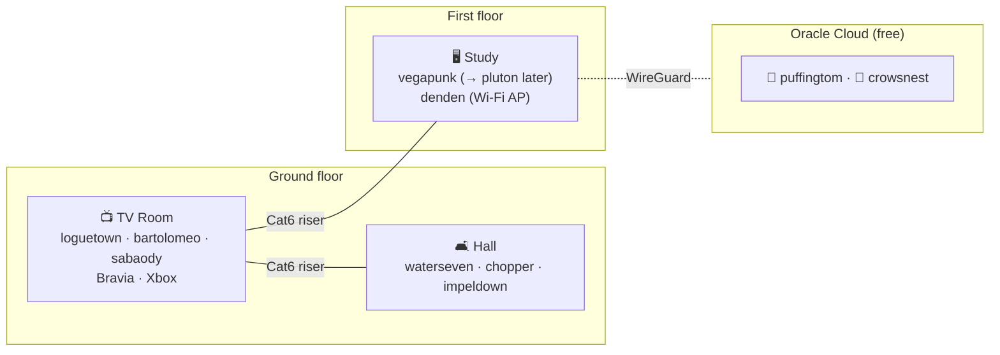

# 01 · The Fleet

Every machine, its role, its **honest limits**, and its **upgrade headroom**. Hostnames are lowercase and DNS-friendly; **names stay with the hardware** — when `pluton` arrives and the current `vegapunk` machine moves downstairs, it keeps the name `vegapunk`.

---

## Network & infrastructure

### 🌐 `loguetown` — JIO Fiber ONT/router
| | |
|---|---|
| **Role** | ISP handoff; kept in router mode (double-NAT — see below) |
| **Location** | TV room |
| **Limits** | JIO uses **MAC-based auth** and almost certainly **CGNAT** → no public IPv4, bridge mode is fragile. We don't fight it. |
| **Decision** | Leave in default mode; `bartolomeo` does DHCP-client on WAN and becomes the real router. Reach from outside is solved at [10 · External access](10-external-access.md), not here. |

### 🛡️ `bartolomeo` — SKULLSAINTS Agni (Intel N150)
| | |
|---|---|
| **Specs** | Intel N150 (4C/4T, Alder Lake-N, **AES-NI**), 16 GB, M.2 SSD, **dual 2.5 GbE** |
| **Role** | OPNsense firewall/router · AdGuard Home + Unbound · Caddy reverse proxy · Authelia · Vaultwarden · CrowdSec |
| **Fit** | Plenty for ~1 Gbps JIO + gigabit LAN. NAT at 1 Gbps ≈ 12–15% CPU; with IDS ≈ 45–65%. |
| **Limits** | **Only 2 NICs**: one WAN, one LAN **trunk** carrying all tagged VLANs into `sabaody`. No QuickAssist (N150 has none) — irrelevant, AES-NI covers WireGuard. |
| **Headroom** | Comfortable. If IDS/IPS on all VLANs ever saturates it, that's the trigger to move firewalling to a bigger box — not expected. |

> [!NOTE]
> The dual NIC is why this box can be a *proper* router-on-a-stick with a clean WAN/LAN split, rather than relying on the switch alone. See [02 · Network](02-network.md).

### 🔀 `sabaody` — TP-Link TL-SG108E
| | |
|---|---|
| **Role** | 8-port "Easy Smart" managed switch; 802.1Q VLAN trunk hub in the TV room |
| **Limits** | Web-UI only (no CLI); **32 simultaneous VLANs**; classic PVID/untagged-membership gotchas; had **CVE-2025-0729/0730** — fixed in firmware **Build 20250124 Rel.54920+** (update on day one). |
| **Headroom** | 8 ports is the real ceiling. TV room already needs: uplink to `bartolomeo`, Bravia, Xbox, riser→hall, riser→study. Plan port budget carefully (see [02](02-network.md)); a second cheap switch may be needed at the study end. |

### 🔀 `waterseven` — TP-Link TL-SG105E (hall VLAN switch)
| | |
|---|---|
| **Role** | 5-port 802.1Q "Easy Smart" switch in the hall; splits the single riser **trunk** from `sabaody` back into access ports for `chopper` (VLAN 30) and `impeldown` (VLAN 60) |
| **Why it exists** | The hall has two devices on **different VLANs** sharing one riser cable — that cable is a tagged trunk, so a VLAN-aware switch must split it. A passive "splitter" cannot ([see doc 02](02-network.md#do-i-need-a-switch-or-an-ethernet-splitter-for-the-hall)). |
| **Day-0 dependency** | `impeldown`'s VLAN-60 isolation is only enforceable if `waterseven` exists and is configured — **buy + configure it before bringing `impeldown` online** (Phase 4). Same firmware-update + PVID discipline as `sabaody`. |
| **Alt** | A second **TL-SG108E** (8-port) for uniformity with `sabaody` and spare ports. |

### 📡 `denden` — TP-Link Archer AC1750
| | |
|---|---|
| **Role** | Wi-Fi **access point** (not router) on the first floor, fed by the riser |
| **Limits** | Consumer firmware may only do **one VLAN per LAN port**, not per-SSID tagging. If per-SSID VLANs are needed (trusted + IoT + guest SSIDs), that's the upgrade trigger to an **Omada EAP** or OpenWrt-flashable AP. |

---

## Compute

### 🗄️ `poneglyph` — Minisforum N5 (the NAS)
| | |
|---|---|
| **Specs** | AMD Ryzen 7 255, **16 GB DDR5 (1 SO-DIMM slot free)**, 512 GB NVMe (boot/apps), **1× 4 TB Seagate IronWolf** |
| **Role** | Proxmox VE 9.2 host: ZFS storage + all app containers (media, Immich, docs, git, cloud, monitoring) |
| **Limits (important)** | ⚠️ **16 GB is the #1 constraint.** ZFS ARC + host + ~20 containers is tight. ⚠️ **A single 4 TB drive has no redundancy** — one disk failure = total loss. |
| **Fixes (planned)** | ➕ Add a **2nd 16 GB DDR5-5600 SO-DIMM → 32 GB** (buy soon — RAM prices rising, see [15](15-roadmap.md)). ➕ Add a **2nd 4 TB IronWolf → ZFS mirror** (redundancy). |
| **Headroom** | After 32 GB + mirror it's a capable 24/7 app host. NVMe can later host a "special vdev"/L2ARC if needed. |

### 🧠 `vegapunk` — First-floor primary PC (LLM server *now*)
| | |
|---|---|
| **Specs** | Intel Core Ultra 265K, **RTX 5070 Ti 16 GB (Blackwell)**, 64 GB DDR5, 2 TB SSD; dual-boot Win 11 + Pop!\_OS 24.04 |
| **Role** | Serves local LLMs to the whole LAN over an OpenAI-compatible API (Ollama/llama.cpp) |
| **Limits** | **16 GB VRAM** caps you below dense-32B and serious coding-MoE models (see [08](08-ai-llm.md)). Being someone's daily-driver desktop makes 24/7 serving awkward. |
| **Plan** | When `pluton` arrives, LLM serving moves to it; this machine **moves to the ground floor** (keeping the name `vegapunk`) as a secondary/backup inference node and desktop. Keep the Pop!\_OS side for headless serving; Windows stays for the odd game. |

### ⚡ `pluton` — Future AI workstation (*≈2 months out*)
| | |
|---|---|
| **Planned** | Ryzen 9800X3D · **AMD Radeon AI PRO R9700 32 GB (RDNA4)** · 64 GB DDR5 · MSI MPG 1050 W ATX 3.1 |
| **Role** | Primary LLM server + primary desktop; **possible 2nd R9700 → 64 GB VRAM** for 70–80B-class MoE models |
| **Notes** | RDNA4 is genuinely supported in July 2026 — llama.cpp ships ROCm 7.2 binaries, Ollama lists the R9700 explicitly, vLLM support is maturing. 32 GB unlocks a big step up (see [08](08-ai-llm.md)). |

### 🎓 `chopper` — Ground-floor desktop (son's PC)
| | |
|---|---|
| **Specs** | Ryzen 7 3700X, RTX 2070 Super, 32 GB, 1 TB SSD + 2 TB HDD |
| **Role** | Study, development, gaming. **The only machine allowed to reach `impeldown`.** |
| **Future** | This is the box being **upgraded to the `pluton` spec**. Post-upgrade, the old 3700X parts can become a spare Proxmox node or be retired. |

### ⛓️ `impeldown` — Beelink SER5 (the locked room)
| | |
|---|---|
| **Specs** | Ryzen 7 5800H (8C/16T, Zen 3), **Radeon Vega 8 iGPU**, 16 GB DDR4, 500 GB SSD |
| **Role** | **Dual-boot:** (1) cybersecurity sandbox — Kali + VMs; (2) retro gaming/emulation — Batocera |
| **Limits** | ⚠️ **Vega 8 iGPU**: great for retro→PS2/GameCube/Wii, **not** PS3/PS4/Switch. ⚠️ **16 GB** rules out heavy AD labs (GOAD wants 20–32 GB). |
| **Isolation** | Lives on **VLAN 60**, a firewalled dead-end; only `chopper` can reach it. See [13 · impeldown labs](13-impeldown-labs.md). |

---

## Cloud (Oracle Always Free — ARM Ampere)

> [!WARNING]
> Oracle **halved** the Always Free ARM allocation on **15 June 2026** to **2 OCPU / 12 GB total** (from 4/24) for free-tier accounts. Egress stays 10 TB/mo. Plan `puffingtom` + `crowsnest` within 2 OCPU/12 GB combined.

### 🚂 `puffingtom` — public edge / tunnel
Public IPv4 endpoint. Runs Pangolin + Newt (or Caddy + WireGuard) to expose selected home services without CGNAT pain. See [10](10-external-access.md).

### 🔭 `crowsnest` — external vantage
Watches the home from *outside*: Uptime Kuma / Gatus probes, tunnel health, and (optionally) off-site backup target. Also serves as the always-on "heartbeat" that keeps the free tier from being reclaimed for idleness.

---

## Other clients (not servers, but on the network)
3 laptops · 3 Android phones · 1 iPhone · 1 Samsung A9 tablet · Sony Bravia 55" (wired) · Xbox One (wired). These live on **Trusted (30)** or **IoT/TV (40)** VLANs and consume services + the LLM endpoint.

## "Will everything be reachable from my main PC?" — yes
Every headless box (`bartolomeo`, `poneglyph`, `impeldown`, the VPSs) is administered **without a monitor** via **SSH keys**, Proxmox's web UI, and **Tailscale SSH** for the ones on the tailnet. Full remote-access model — including how the isolated `impeldown` is reached only from `chopper` — is in **[02 · Network → Remote access](02-network.md#remote--ssh-access)**.

Next: **[02 · Network & VLANs →](02-network.md)**
