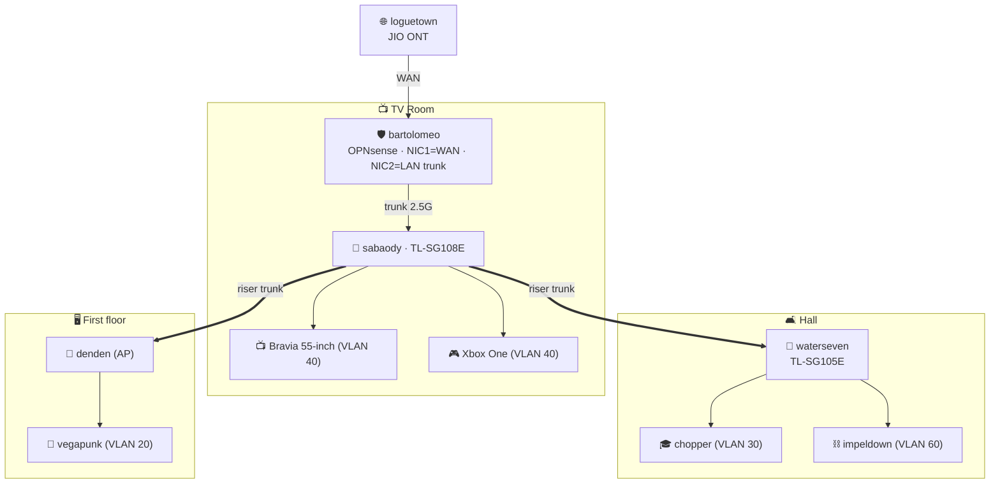
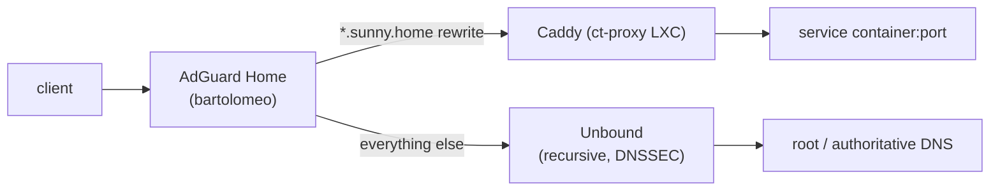

# 02 · Network & VLANs

This is the backbone. It answers: how the cable actually runs, how services get **names not IPs**, how the cyber sandbox is **isolated to a single machine**, and how everything headless is **reached over SSH**.

## Physical topology & wiring

Existing runs (already pulled): TV room → hall, and TV room → first-floor `denden`. `chopper` is wired in the hall; `vegapunk` is wired to `denden` upstairs.



> [!IMPORTANT]
> **Port budget on `sabaody` (8 ports):** WAN-side stays on `bartolomeo`. Switch ports used: **1** uplink to `bartolomeo`, **2** Bravia, **3** Xbox, **4** riser→hall, **5** riser→study. That leaves 3 spare — enough today, but the hall has *two* devices (`chopper` + `impeldown`) on one riser cable, so a **VLAN-aware switch in the hall is required, not optional** — this is **`waterseven`** (TL-SG105E). Because `impeldown`'s isolation depends on it, treat `waterseven` as a **Day-0 prerequisite before `impeldown` goes live**.

### "Do I need a switch or an Ethernet splitter for the hall?"
**A switch — never a splitter.** A passive "Ethernet splitter" only works by stealing pairs and caps you at 100 Mbps with no VLAN awareness; it cannot carry tagged traffic or isolate `impeldown`. Because the hall carries **two different VLANs** (`chopper` on 30, `impeldown` on 60) over **one riser cable**, that cable must be a **tagged trunk**, and you need a **VLAN-capable switch** in the hall to split it back out into two access ports. That switch is **`waterseven`** — a **TP-Link TL-SG105E** (5-port 802.1Q "Easy Smart", ~₹1,500–2,000; a 2nd TL-SG108E is the 8-port alternative). It is the *reason* `impeldown` can be isolated at all, so it's a Day-0 buy before that box comes online.

## VLAN scheme

| VLAN | Name | Subnet | Who | Egress policy |
|---|---|---|---|---|
| 1 | *(unused)* | — | parking only | never used for real traffic |
| 10 | Management | `10.10.10.0/24` | OPNsense mgmt, `sabaody`/hall-switch UIs, `denden` admin, Proxmox, IPMI | admin workstation only |
| 20 | Servers | `10.10.20.0/24` | `poneglyph`, `vegapunk`/`pluton`, all service containers | serves other VLANs; tight outbound |
| 30 | Trusted LAN | `10.10.30.0/24` | `chopper`, laptops, personal phones, trusted Wi-Fi | full internet; may reach Servers |
| 40 | IoT / TV | `10.10.40.0/24` | Bravia, Xbox, cast devices, smart plugs | internet only; no lateral access |
| 50 | Guest | `10.10.50.0/24` | guest Wi-Fi | internet only, client isolation |
| 60 | **Sandbox** | `10.10.60.0/24` | **`impeldown` only** | **dead-end — default deny all, incl. internet unless toggled** |

## Firewall policy (inter-VLAN matrix)

`✅` allowed · `⛔` blocked · `➡️` allowed to specific hosts/ports only

| from ↓ \ to → | Mgmt 10 | Servers 20 | Trusted 30 | IoT 40 | Guest 50 | Sandbox 60 | WAN |
|---|---|---|---|---|---|---|---|
| **Mgmt 10** | ✅ | ✅ | ✅ | ✅ | ✅ | ✅ | ✅ |
| **Servers 20** | ⛔ | ✅ | ⛔ | ➡️ cast | ⛔ | ⛔ | ➡️ updates |
| **Trusted 30** | ⛔ | ➡️ svc ports | ✅ | ➡️ cast | ⛔ | ➡️ **to `impeldown` from `chopper` only** | ✅ |
| **IoT 40** | ⛔ | ⛔ | ⛔ | ✅ | ⛔ | ⛔ | ✅ |
| **Guest 50** | ⛔ | ⛔ | ⛔ | ⛔ | ✅ | ⛔ | ✅ |
| **Sandbox 60** | ⛔ | ⛔ | ⛔ | ⛔ | ⛔ | ✅ | ⛔ *(toggle)* |

### Sandbox isolation — the exact rule
```
# On OPNsense, VLAN 60 (Sandbox):
1. pass  in  proto {tcp,udp}  from 10.10.30.15 (chopper)  to 10.10.60.0/24   # only chopper reaches it
2. block in  from 10.10.60.0/24 to { 10.10.0.0/16 }  (all RFC1918)           # nothing escapes to LAN
3. block in  from 10.10.60.0/24 to any   # default no internet…
4. pass  in  from 10.10.60.0/24 to any   # …enabled ONLY via a toggle that AUTO-EXPIRES after 1h (doc 12)
```
`impeldown` gets internet only when you flip an alias/schedule — and **that rule auto-disables after 1 hour** (an OPNsense time-based schedule, or the n8n flow in [doc 12](12-automation.md#4-sandbox-internet-auto-off)), so a *forgotten* toggle can't leave the sandbox online. A detonated sample can't phone home by default, and can *never* pivot into Servers or Mgmt. Detail: [13 · impeldown labs](13-impeldown-labs.md). Exact OPNsense steps: [runbook 02](runbooks/02-opnsense-wireguard.md).

### Monitoring and reverse-proxy exception: VLAN 20 to Mgmt

The matrix blocks Servers (20) → Mgmt (10) — correct — but two VLAN-20 hosts have a *legitimate, narrow* need to reach mgmt web UIs:
- **`ct-proxy` (10.10.20.9)** proxies `proxmox.sunny.home` (and other mgmt UIs) — its Caddy must reach them.
- **`ct-observe` (10.10.20.16)** runs the Homepage `siteMonitor` / Proxmox-widget checks for the dashboard.

> [!NOTE]
> The **Proxmox *host* management interface is on VLAN 10 (`10.10.10.2`)**; its *guest containers* are on VLAN 20 (`10.10.20.x`). So even reaching the Proxmox UI from a Servers-VLAN host crosses into Mgmt.

Add a **single least-privilege pass rule** on the Servers (VLAN 20) interface, *above* the block-to-Mgmt rule:

| Action | Source | Destination | Ports | Purpose |
|---|---|---|---|---|
| Pass | `10.10.20.9`, `10.10.20.16` | `10.10.10.1` (OPNsense / AdGuard) | `443`, `3000` | proxy + monitor firewall/DNS UIs |
| Pass | `10.10.20.9`, `10.10.20.16` | `10.10.10.2` (Proxmox) | `8006` | proxy + monitor the hypervisor |
| Block | `VLAN20 net` | `10.10.10.0/24` | any | everything else Servers→Mgmt stays blocked |

Without this, those `siteMonitor` checks (and the `proxmox.sunny.home` route) silently time out and show **offline** — a classic homelab trap. Keep it this narrow: two source IPs, three ports, nothing else.

## `sabaody` (TL-SG108E) config — avoid the classic traps

> [!WARNING]
> The TL-SG108E's three footguns, in order of pain:
> 1. Every port ships as an **untagged member of VLAN 1** — you must *remove* it from VLAN 1's untagged list when reassigning, or it silently leaks VLAN 1.
> 2. **PVID is set separately** from membership — assigning a port to VLAN 20 does nothing to untagged ingress until you also set its PVID to 20.
> 3. Keep **one access port on VLAN 1/PVID 1** as an escape hatch while configuring, or you can lock yourself out of the web UI. Back up the config after each change.

| `sabaody` port | Mode | PVID | Tagged members |
|---|---|---|---|
| 1 → `bartolomeo` | **Trunk** | 10 | 20,30,40,50,60 |
| 2 → Bravia | Access | 40 | — |
| 3 → Xbox | Access | 40 | — |
| 4 → riser (hall) | **Trunk** | 10 | 30,60 |
| 5 → riser (study, `denden`) | **Trunk** ⚠️ | 30 | 10,20,40,50 |
| 6 → `poneglyph` | **Trunk (all-tagged)** | 1 | 10,20 |

*(Port 5's native is VLAN 30, not Mgmt — `denden` on stock firmware isn't VLAN-aware; see the denden trap in runbook 05.)*

> Full port maps for **both** switches (incl. `waterseven` and the `poneglyph` all-tagged trunk), the **`denden` AP trunk trap**, and the untagged-VLAN-1 step-by-step: **[runbook 05](runbooks/05-switch-vlan-config.md)**.

## DNS: names, not IPs

**Split-horizon** so the same name works inside and (for shared services) outside:



- **AdGuard Home** is the LAN resolver (ad/tracker filtering + DoH upstream) with **DNS rewrites**: `*.sunny.home → 10.10.20.x` (the Caddy host).
- **Caddy** terminates TLS and routes by hostname to the right container, so users type `immich.sunny.home`, `jellyfin.sunny.home`, `git.sunny.home` — never an IP or port.
- **Unbound** does recursive resolution for everything else, so no upstream provider profiles your queries.
- Internal TLS uses an **internal CA** (Caddy `internal`) or Let's Encrypt DNS-01 for a real domain; externally shared names resolve to the VPS (see [10](10-external-access.md)).

Naming convention: `<service>.sunny.home` internally; `<service>.<yourdomain>` for the handful shared to family.

## Remote & SSH access

Everything headless is managed without a monitor:

| Target | Primary access | Notes |
|---|---|---|
| `bartolomeo` (OPNsense) | Web UI on Mgmt VLAN + SSH key | never exposed to WAN |
| `poneglyph` (Proxmox) | Proxmox web UI (8006) + SSH key | snapshots/backups from here |
| Containers/VMs | Caddy-proxied web UIs; `pct enter` / `qm` from Proxmox | — |
| `impeldown` | SSH **from `chopper` only** (firewall rule) | matches the isolation policy |
| VPSs | SSH **key-only, non-standard port**, CrowdSec | see [11](11-security.md) |

**Tailscale SSH** ties it together: put the admin machine and each headless host on the tailnet, and you get authenticated SSH (with ACLs) to any of them from anywhere — including your phone — without opening a single inbound port. Your primary PC can reach `poneglyph`, `bartolomeo`, and the VPSs directly; `impeldown` deliberately stays *off* the tailnet and reachable only from `chopper` on the LAN.

Next: **[03 · Virtualization →](03-virtualization.md)**
