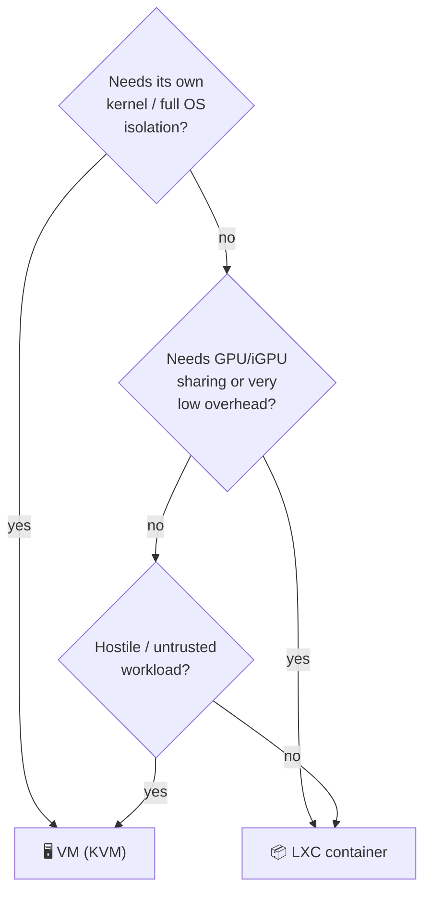

# 03 · Virtualization — Proxmox, VM vs LXC, resource sizing

**Hypervisor:** Proxmox VE **9.2-1** on `poneglyph`. ([roadmap/docs](https://pve.proxmox.com/wiki/Roadmap)) `impeldown` and the GPU boxes run bare-metal (see [13](13-impeldown-labs.md) and [08](08-ai-llm.md)); `bartolomeo` runs OPNsense bare-metal for a clean network trust boundary.

## The VM-vs-LXC rule of thumb

| Use **LXC** when… | Use a **VM** when… |
|---|---|
| Native Linux service, minimal overhead | You need a non-Linux or full-OS appliance (Home Assistant OS, OPNsense) |
| You want to **share the iGPU** (`/dev/dri` bind-mount is trivial in LXC) | You want hard kernel isolation / live migration / PCIe passthrough |
| Running Docker *inside* a grouped stack (nesting=1) | The workload is untrusted (malware, exposed edge) |
| Fast clone/snapshot of a small footprint | Kernel modules / custom kernel needed |

**Pattern used here:** grouped **Docker-in-LXC** stacks by domain (media, library, cloud, automation, observability) rather than one monster LXC or dozens of tiny ones. This keeps failure domains small, snapshots meaningful, and lets each stack share the iGPU where useful. Compose files managed with **Dockge** (or Komodo) for a Git-driven UI. VMs are reserved for the few things that truly need them.

## Service placement & resource allocation (`poneglyph`, 32 GB target)

> vCPU are shared (over-commit is fine at home); RAM is the real budget. Disk splits **appdata → NVMe**, **media/bulk → HDD ZFS mirror** (see [04](04-storage.md)).

| Guest | Type | Services | vCPU | RAM | Disk (appdata) | GPU | Notes |
|---|---|---|---:|---:|---:|:--:|---|
| `ct-media` | Docker-LXC | Jellyfin, Seerr, Radarr, Sonarr, Prowlarr, Bazarr, SABnzbd, Decypharr | 6 | 6 GB | 20 GB | ✅ iGPU | Jellyfin HW transcode via `/dev/dri`; media on HDD |
| `ct-photos` | Docker-LXC | Immich (server + ML) | 4 | 4 GB | 30 GB | ✅ iGPU | ML can offload to `vegapunk` ([08](08-ai-llm.md)); library on HDD |
| `ct-library` | Docker-LXC | Paperless-ngx, Kavita, Navidrome | 3 | 3 GB | 15 GB | — | Docs/books/music on HDD |
| `ct-cloud` | Docker-LXC | Nextcloud AIO, Collabora | 4 | 4 GB | 20 GB | — | AIO is Nextcloud's official turnkey path |
| `ct-git` | LXC | Forgejo | 2 | 1 GB | 10 GB | — | Native LXC, tiny |
| `ct-proxy` | Docker-LXC | Caddy, Authelia, Vaultwarden, CrowdSec, redis | 2 | 1.5 GB | 10 GB | — | **Web + identity tier, moved off the firewall** ([doc 05](05-core-services.md)) — unprivileged |
| `ct-automation` | Docker-LXC | n8n, ntfy | 2 | 2 GB | 10 GB | — | Talks to AdGuard/Radarr/Telegram ([12](12-automation.md)) |
| `ct-observe` | Docker-LXC | Homepage, Uptime Kuma, Beszel, Grafana, Loki, Alloy | 3 | 3 GB | 20 GB | — | Central logs + dashboards ([09](09-observability.md)) |
| `vm-pbs` | VM | Proxmox Backup Server | 2 | 2 GB | 32 GB | — | Dedup backups; can also be its own tiny box later |
| `vm-hass` *(opt)* | VM | Home Assistant OS | 2 | 2 GB | 32 GB | — | Only if home-automation grows ([12](12-automation.md)) |
| **Reserve** | — | ZFS ARC + host | — | ~5–6 GB | — | — | Cap `zfs_arc_max` (~6–8 GB) |

**RAM budget:** ~28–29 GB committed (now incl. `ct-proxy`) + ARC/host. At 32 GB you must **cap `zfs_arc_max` to ~4 GB** — it genuinely fits, but 32 GB is the **floor**. As the container set grows, **2×32 GB = 64 GB** (the N5's max) is the comfort target.

> [!WARNING]
> This is exactly why **16 GB is not enough** on `poneglyph`. At 16 GB, ARC + host eats ~8 GB and you'd have ~8 GB for all guests — you'd be OOM-killing containers constantly, and memory-spiky jobs like **Immich face-recognition scans** and **Nextcloud file indexing** would tip it over. The **32 GB upgrade is a Day-0 blocking prerequisite, not a roadmap nice-to-have** — do it before go-live. ([15 · shopping](15-roadmap.md))

## What lives on other hosts (not `poneglyph`)

| Host | Virtualization | What |
|---|---|---|
| `bartolomeo` | bare-metal | OPNsense + AdGuard/Unbound + WireGuard + CrowdSec firewall bouncer. Reverse proxy/SSO/vault deliberately **not** here → `ct-proxy` LXC ([doc 05](05-core-services.md)) |
| `vegapunk`/`pluton` | bare-metal (Pop!\_OS) | LLM serving (Ollama/llama.cpp/vLLM) + LiteLLM; GPU stays on the metal for full performance |
| `impeldown` | bare-metal dual-boot + nested KVM/VirtualBox | Kali host + throwaway target VMs; Batocera on the other boot |
| `puffingtom`/`crowsnest` | Oracle VM (given) | Docker: Pangolin/Newt, reverse proxy, monitoring probes |

> [!NOTE]
> **GPU & LLMs stay bare-metal.** You *can* PCIe-passthrough a GPU into a Proxmox VM, but for a daily-driver desktop that also serves LLMs, dual-booting Pop!\_OS and running the inference server natively is simpler and faster than passthrough. Revisit passthrough only if `pluton` becomes a dedicated headless AI node.

## Operational niceties
- **Templates:** one hardened Debian 13 LXC template → clone for each stack. Consistent base = easy patching.
- **Tags & pools:** tag guests by VLAN/role; a Proxmox pool per domain for quota visibility.
- **Snapshots before upgrades:** every stack is snapshotted pre-update; rollback in seconds ([11 · ops](11-security.md)).
- **Compose files:** ready-to-run, sanitized per-stack compose lives in [`stacks/`](../stacks/) — one folder per grouped LXC in this table, with `mem_limit`/`cpus` set to these budgets and image tags pinned to [doc 16](16-versions.md).
- **Bootstrap:** first-time Proxmox install + VLAN-aware bridge (host mgmt on VLAN 10, guests tagged VLAN 20) + ZFS mirror + base template are in [runbook 04](runbooks/04-proxmox-vlan-bootstrap.md).
- **IaC option:** the whole layout is reproducible with Terraform (`bpg/proxmox`) + Ansible if you want to show that in the portfolio.

Next: **[04 · Storage & backup →](04-storage.md)**
