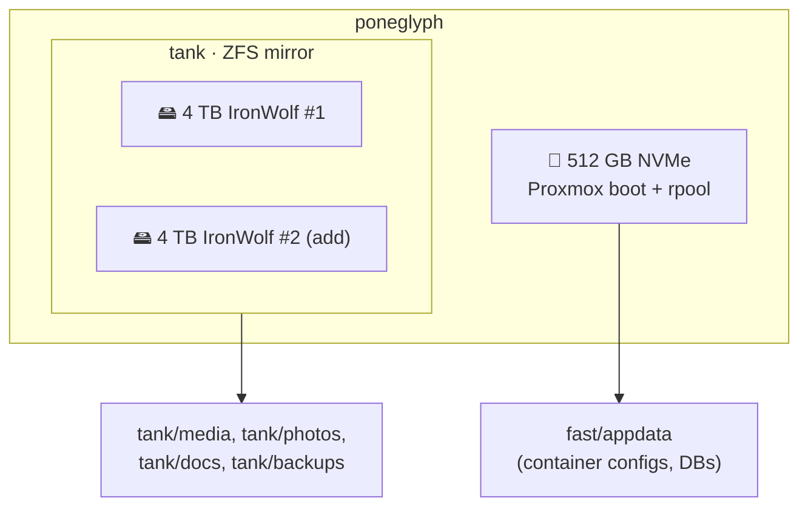
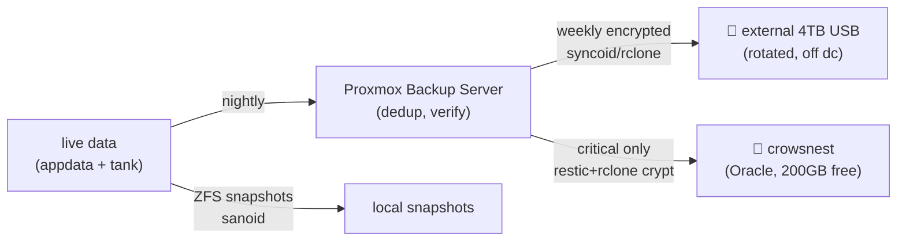

# 04 · Storage & Backup

## NAS-OS decision: Proxmox + ZFS (not TrueNAS / Unraid)

| Option | Verdict for `poneglyph` |
|---|---|
| **Proxmox VE + ZFS** ✅ **chosen** | You already need a hypervisor for ~20 containers; ZFS is first-class in Proxmox. One OS, native snapshots/replication, LXC iGPU sharing. File shares via a small SMB/NFS LXC. |
| TrueNAS Community Edition | Excellent *storage* appliance, but you'd then virtualize all apps under it or add a second box; disk passthrough on the N5 (onboard SATA/NVMe, no HBA) is awkward. |
| Unraid 7.x | Great for **mismatched** disk sizes + easy expansion, license cost, parity (not ZFS-native for the array). Overkill/misfit when you have a clean 2×4 TB mirror and want Proxmox anyway. |

## Layout



- **`rpool`** (NVMe): Proxmox + guest root disks + **appdata/databases** (fast, low-latency). Immich/Paperless/Nextcloud DBs live here.
- **`tank`** (2×4 TB **mirror** = 4 TB usable): bulk media, photo library, documents, and the local backup target. A mirror survives **one** drive failure and rebuilds fast.

> [!WARNING]
> **A single 4 TB drive today has zero redundancy — one failure loses everything.** Adding the second 4 TB IronWolf to form a mirror is a **Day-0 blocking prerequisite: buy it before you put real data on the box.** Buy from a *different batch/retailer* to avoid correlated failure. ([15 · shopping](15-roadmap.md))

> [!WARNING]
> **The boot/app NVMe (`rpool`) is a single point of failure.** PBS backs up its *contents* nightly, but if the NVMe itself dies the hypervisor is down until rebuilt. Two options:
> - **(A) Recommended — mirror `rpool`:** add a 2nd small NVMe/SATA SSD and install Proxmox onto a **ZFS mirror**, matching the data pool's redundancy. The N5 has spare M.2/SATA. A boot disk can then fail with zero downtime.
> - **(B) Accept the RTO:** staying single-disk means an NVMe failure = **~1–3 h downtime** (reinstall Proxmox → `zpool import tank` → restore guests from PBS). Drill it with the [bare-metal restore runbook](runbooks/03-proxmox-bare-metal-restore.md).

### ZFS tuning for a 32 GB box
```bash
# Cap ARC so containers get their RAM (put in /etc/modprobe.d/zfs.conf)
options zfs zfs_arc_max=8589934592   # 8 GiB
```
- `ashift=12`, `compression=lz4` (free space + speed), `atime=off` on media datasets.
- Weekly `zpool scrub`; email/ntfy alert on `DEGRADED`.
- NVMe can later host a small **special/L2ARC vdev** if metadata-heavy workloads (Immich thumbnails) need it — not required at 4 TB.

## File sharing to the house
A tiny **SMB/NFS LXC** (Turnkey File Server or a Debian LXC + Samba) bind-mounts `tank/*` and exposes shares to Trusted-VLAN clients. Time Machine-style history for laptops via `vfs_fruit`. Windows/macOS/Linux + the Bravia all mount it.

## Backup — 3-2-1 for $0 recurring

> **3** copies · **2** media · **1** off-site — achieved without a subscription.



| Tier | Tool | Target | Scope | Cost |
|---|---|---|---|---|
| Local dedup | **Proxmox Backup Server** (LXC/VM) | `tank/backups` | all VMs/CTs | ₹0 |
| Snapshots | **sanoid/syncoid** or Proxmox ZFS repl. | NVMe→tank | datasets | ₹0 |
| Off-site (small) | **restic** + `rclone crypt` | `crowsnest` (200 GB Oracle free) | Vaultwarden, Paperless, photos-of-record, configs | ₹0 |
| Off-site (bulk, optional) | external **USB HDD**, rotated to another location | — | full PBS datastore | one-time drive cost |

- **Encrypt off-site** (restic native / rclone crypt) — Oracle never sees plaintext.
- Media is *not* backed up off-site (re-downloadable); **irreplaceable data** (photos, docs, password vault, git) is.
- **Oracle's 200 GB is for configs + the password vault + photos-of-record only.** As the Immich library grows past that, its bulk lives on the **encrypted rotated USB drive** (below) — `crowsnest` stays a small, always-online copy of the crown-jewel data.
- Backblaze B2 / Storj are options once you outgrow the USB — but they're **recurring cost**, so they're out of the $0 baseline.

### Encrypting the off-site USB drive
The rotated USB drive leaves the house, so it **must** be encrypted — if it's lost or stolen, family photos and documents must stay unreadable. Two solid options:

**Option A — LUKS (simplest, portable):**
```bash
cryptsetup luksFormat /dev/sdX          # one-time, set a strong passphrase
cryptsetup open   /dev/sdX usbcrypt     # unlock → /dev/mapper/usbcrypt
mkfs.ext4 /dev/mapper/usbcrypt          # format once (or xfs)
# ...run the backup (rsync the PBS datastore, or restic)...
cryptsetup close usbcrypt               # lock before unplugging
```

**Option B — ZFS native encryption (best when the USB is a `syncoid` target):**
```bash
zpool create -O encryption=aes-256-gcm -O keyformat=passphrase usbtank /dev/sdX
syncoid --recursive tank usbtank/tank   # send encrypted snapshots
zpool export usbtank                    # then unplug
```

Store the passphrase/keyfile in **Vaultwarden** *and* on paper in a safe — lose it and the backup is gone too. **Rotate two drives (A/B)**, keeping one at a relative's house at all times so a house-level disaster (fire/theft) never takes the last copy.

### Restore drills (the part people skip)
Quarterly: restore one CT and one critical dataset from PBS to a scratch location and boot/verify. A backup you've never restored is a hope, not a backup. Log the drill in [09 · observability](09-observability.md).

Next: **[05 · Core services →](05-core-services.md)**
