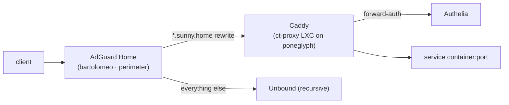

# 05 · Core Services — network core + web/identity tier

> [!IMPORTANT]
> **Keep the firewall a firewall.** `bartolomeo` runs *only* routing, firewall, WireGuard, and DNS. The internet-facing **web tier** (reverse proxy) and **identity tier** (SSO + password vault) run in an **unprivileged LXC (`ct-proxy`) on `poneglyph`**, inside the Servers VLAN. A Caddy or Authelia exploit then lands in a disposable container — **not root on your perimeter firewall.** This is the single most important blast-radius decision in the build.

## A · `bartolomeo` — network core (perimeter only)

| Service | Version (Jul 2026) | Role | Docs |
|---|---|---|---|
| **OPNsense** | 26.1.10 *(26.7 ~Jul 15)* | Firewall, routing, VLANs, WireGuard, DHCP | [docs.opnsense.org](https://docs.opnsense.org/) |
| **AdGuard Home** | 0.107.75 | LAN DNS, ad/tracker block, DoH upstream, DNS rewrites | [wiki](https://github.com/AdguardTeam/AdGuardHome/wiki) |
| **Unbound** | current | Recursive, DNSSEC-validating resolver behind AdGuard | [docs](https://unbound.docs.nlnetlabs.nl/) |

That's the whole list. No application-layer software with a large attack surface runs here. CrowdSec's **firewall bouncer** runs on OPNsense (enforcement), but its decisions come from the parser in `ct-proxy` (below).

## B · `ct-proxy` — web + identity tier (LXC on `poneglyph`, VLAN 20)

| Service | Version (Jul 2026) | Role | Docs |
|---|---|---|---|
| **Caddy** | 2.10.x | Reverse proxy, automatic TLS, service names | [caddyserver.com](https://caddyserver.com/docs/) |
| **Authelia** | 4.39.20 | SSO + MFA forward-auth in front of Caddy | [authelia.com](https://www.authelia.com/) |
| **Vaultwarden** | 1.36.0 | Bitwarden-compatible family password vault | [wiki](https://github.com/dani-garcia/vaultwarden/wiki) |
| **CrowdSec** | current | Log parser → decisions (enforced by the OPNsense bouncer) | [docs.crowdsec.net](https://docs.crowdsec.net/) |

Runnable compose: [`stacks/ct-proxy/`](../stacks/ct-proxy/). Sizing in [doc 03](03-virtualization.md).



> [!NOTE]
> **Why no WAN port-forward?** Under JIO **CGNAT** there's no public inbound, so internal clients reach `ct-proxy` Caddy purely via **split-horizon DNS** (AdGuard rewrites `*.sunny.home` → the `ct-proxy` IP). External/family access comes through the **`puffingtom` tunnel** ([doc 10](10-external-access.md)) → the internal Caddy. If you ever had a public IP, the pattern would be "OPNsense forwards 80/443 → `ct-proxy` Caddy," never to the firewall itself.

## Why these (vs the alternatives)
- **OPNsense over pfSense CE** — predictable bi-weekly patching, native in-kernel WireGuard, single codebase, full REST API.
- **AdGuard Home over Pi-hole** — built-in DoH/DoT/DoQ upstream, per-client policies (needed for the [YouTube toggle](12-automation.md)), light footprint. Stays on the firewall because DNS *is* a core network function (and must survive even if `poneglyph` is down).
- **Caddy over Traefik/NPM** — zero-config automatic HTTPS; cleanest way to give every service a name + cert.
- **Authelia over Authentik** — a lightweight Go forward-auth gateway is right-sized; Authentik's full IdP is the documented "phase 2."
- **CrowdSec over fail2ban** — community threat intel; parser in `ct-proxy`, enforcement via the OPNsense firewall bouncer (one authority).

## Reverse proxy & names
Caddy (on `ct-proxy`) holds one route per service. Sanitized `Caddyfile` lives in [`stacks/ct-proxy/config/caddy/`](../stacks/ct-proxy/):
```caddy
jellyfin.sunny.home   { reverse_proxy 10.10.20.11:8096 }
immich.sunny.home     { reverse_proxy 10.10.20.12:2283 }
git.sunny.home        { reverse_proxy 10.10.20.15:3000 }
proxmox.sunny.home {
    forward_auth 10.10.20.9:9091 { uri /api/authz/forward-auth }   # Authelia
    reverse_proxy https://10.10.20.2:8006 { transport http { tls_insecure_skip_verify } }
}
```
Internal certs via Caddy's `internal` CA (trust the root on family devices) or Let's Encrypt **DNS-01** for a real domain.

## Identity & secrets
- **Authelia**: `one_factor` for low-risk apps (Jellyfin has its own login), `two_factor` (TOTP/WebAuthn) for admin surfaces (Proxmox, OPNsense, Dockge, n8n).
- **Vaultwarden**: family password manager + the API keys the automations use. Protected by Authelia; backed up in the *critical* off-site tier ([doc 04](04-storage.md)).

> [!WARNING]
> **Vaultwarden holds the passwords you'd need to fix a broken network — so it can't be your only copy.** See the mandatory **[Break-glass procedure](11-security.md#break-glass--offline-credentials)** in doc 11: Proxmox root, OPNsense root, and backup/ZFS passphrases live *offline* (encrypted KeePassXC on a laptop + paper in a safe), independent of Vaultwarden/Authelia/DNS.

## Hardening highlights
- Mgmt surfaces (OPNsense, switch, Proxmox) reachable **only from VLAN 10** + Authelia MFA.
- `ct-proxy` is an **unprivileged** LXC; a web-tier compromise can't touch the firewall or escalate to the Proxmox host.
- CrowdSec firewall bouncer on OPNsense + Caddy log parsing on `ct-proxy`.
- WAN exposes **nothing** inbound (CGNAT); all external reach is via the VPS tunnel ([doc 10](10-external-access.md)).

Next: **[06 · Media stack →](06-media-stack.md)**
