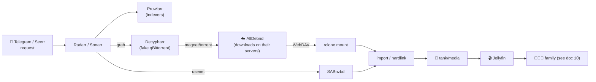

# 06 · Media Stack (`ct-media`, `ct-photos`, `ct-library`)

The family-facing crown jewels: watch, request, read, listen, and remember.

| Service | Version (Jul 2026) | Role | Docs |
|---|---|---|---|
| **Jellyfin** | 10.11.11 | Media server (movies/TV/live) | [jellyfin.org/docs](https://jellyfin.org/docs/) |
| **Seerr** | 3.3.0 | Unified request/discovery (Overseerr+Jellyseerr merge, Feb 2026) | [docs.seerr.dev](https://docs.seerr.dev/) |
| **Radarr** | 6.3.0 | Movie automation | [wiki.servarr.com/radarr](https://wiki.servarr.com/radarr) |
| **Sonarr** | 4.0.19 | TV automation | [wiki.servarr.com/sonarr](https://wiki.servarr.com/sonarr) |
| **Prowlarr** | 2.5.0 | Indexer/tracker manager feeding the *arr apps | [wiki.servarr.com/prowlarr](https://wiki.servarr.com/prowlarr) |
| **Bazarr** | 1.6.0 | Subtitles | [wiki.bazarr.media](https://wiki.bazarr.media/) |
| **SABnzbd** | 5.0.4 | Usenet downloader | [sabnzbd.org](https://sabnzbd.org/) |
| **Decypharr** | 0.7.x | **AllDebrid**/RD/Torbox as a qBittorrent-emulating download client | [github.com/sirrobot01/decypharr](https://github.com/sirrobot01/decypharr) |
| **Immich** | 3.0.2 | Photo/video backup + AI search *(see [08](08-ai-llm.md))* | [immich.app/docs](https://immich.app/docs) |
| **Kavita** | 0.9.0.2 | Books / comics / manga | [wiki.kavitareader.com](https://wiki.kavitareader.com/) |
| **Navidrome** | 0.63.2 | Music (Subsonic API) | [navidrome.org/docs](https://www.navidrome.org/docs/) |

> [!NOTE]
> **Jellyfin stays on the 10.11 line.** The next major jumps straight to **12.0** (dropping the "10." prefix) and is still **RC/unstable** in July 2026 — don't put the family on it yet.

## How a request becomes a playable movie

### AllDebrid integration (Decypharr)
You have an **AllDebrid** subscription — Decypharr turns it into a first-class *arr source:

1. In Radarr/Sonarr/Prowlarr, add a **qBittorrent** download client pointing at **Decypharr** (it speaks the qBittorrent Web API well enough to fool them).
2. Decypharr forwards the magnet/torrent to **AllDebrid's API** — AllDebrid does the actual downloading on *their* servers (instant for cached torrents).
3. Decypharr exposes the finished files back via **WebDAV + rclone mount**, so they appear as local paths.
4. Radarr/Sonarr **import/hardlink** them into `tank/media`; Jellyfin picks them up on scan.

This replaces the older Real-Debrid-only `zurg`/`Riven` combos — Decypharr is provider-agnostic (**AllDebrid confirmed supported**) and unifies the qBit-emulation + mount roles in one binary. Keep **SABnzbd + Usenet** as a parallel, high-reliability source; debrid for breadth/speed, Usenet for retention.

> [!WARNING]
> Debrid/Usenet content sourcing is your responsibility — keep it to legally obtainable material, and note that debrid is a convenience layer, not an archive: if AllDebrid drops a cached torrent, the file's gone until re-grabbed. Anything you want to *keep* should be a real file on `tank`.

## Storage & performance notes
- **Atomic moves + hardlinks:** keep downloads and the library on the **same ZFS dataset** (`tank/media/...`) so imports are instant hardlinks (no double disk usage). Use the TRaSH-Guides folder layout.
- **Hardware transcoding:** the Ryzen 7 255 iGPU is passed into `ct-media` via `/dev/dri` for Jellyfin VAAPI transcodes — keeps CPU cool during remote streams.
- **Direct play first:** set client apps to direct-play; transcoding is the fallback. Remote bitrate cap is set for family streaming ([10](10-external-access.md)).
- **Immich** gets its own container + library dataset and (optionally) offloads ML to `vegapunk` — see [08 · AI](08-ai-llm.md).

## Family UX
- **Seerr** is the front door for requests — nice posters, "already available" checks, per-user approval. Kids request; a parent approves.
- **Jellyfin** per-user accounts (not one shared login), parental ratings on the kids' profiles, and no public signups.
- **Kavita** for the notes-into-reading push (the kids' study material, comics as a carrot); **Navidrome** streams the music library to phones via any Subsonic app.

Next: **[07 · Productivity →](07-productivity.md)**
