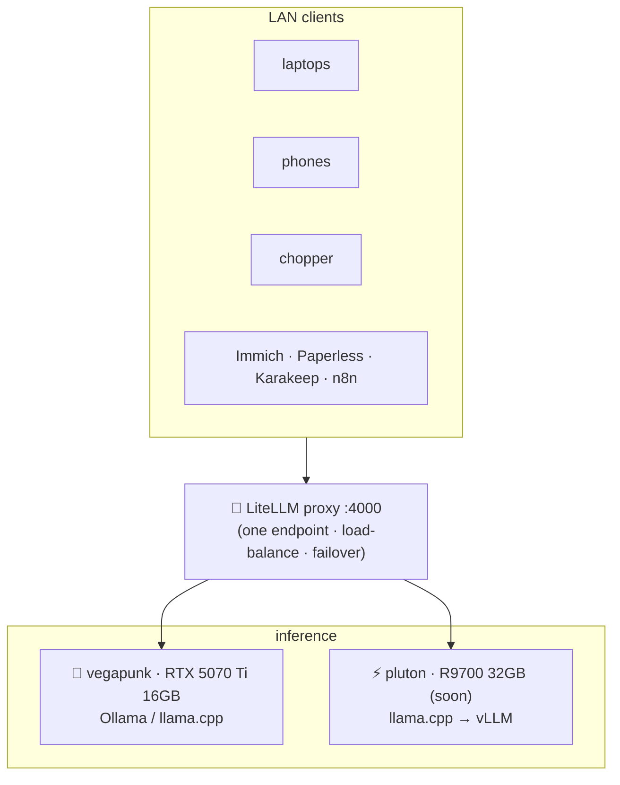

# 08 · AI & Local LLMs

Own the intelligence. LLMs run on `vegapunk` (RTX 5070 Ti 16 GB) today and move to `pluton` (AMD R9700 32 GB, then dual = 64 GB) in ~2 months. Every machine in the house hits **one OpenAI-compatible endpoint**; Immich and Paperless get smarter on the same GPU. **No tokens leave the house.**

## Models — the July 2026 picks

> [!NOTE]
> **Reality check on names:** **Gemma 4** (successor to Gemma 3) is real — lineup E2B/E4B/12B/**26B-A4B**/31B with official **QAT** (quant-aware) checkpoints. **"Qwen 3.6"** is Alibaba's *closed* flagship; the open, self-hostable line is **Qwen3** (0.6–32B, Apache-2.0) plus **Qwen3-Coder / -VL / -Embedding** and **Qwen3.5** (open, up to 397B-A17B MoE). **DeepSeek-V4** (MIT) and **GLM-5.2** (MIT, 1M ctx) are the frontier open models but need a datacenter. Meta's Llama 4 exists but Meta has pivoted its frontier work closed.

| Use case | Model (Jul 2026) | ~VRAM @ quant | 16 GB | 32 GB | 64 GB | Source |
|---|---|---|:--:|:--:|:--:|---|
| Small chat/daily | **Gemma 4 12B** (QAT q4_0) | 7–8 GB | ✅ | ✅ | ✅ | [ai.google.dev/gemma](https://ai.google.dev/gemma/docs/core) |
| Mid reasoning | **Qwen3-32B** (Q4_K_M) | 19–20 GB | ➖ | ✅ | ✅ | [github.com/QwenLM/Qwen3](https://github.com/QwenLM/Qwen3) |
| Mid (fits 16 GB) | **Gemma 4 26B-A4B** (QAT, MoE 4B active) | ~15–16 GB | ⚠️ tight | ✅ | ✅ | [ai.google.dev/gemma](https://ai.google.dev/gemma/docs/core) |
| Coding (32 GB) | **GLM-4.7-Flash** (30B-A3.6B) | ~18.5 GB | ➖ | ✅ | ✅ | [huggingface.co/unsloth](https://huggingface.co/unsloth) |
| Coding (64 GB) | **Qwen3-Coder-Next** (80B-A3B) | ~46 GB | ➖ | ➖ | ✅ | [github.com/QwenLM/Qwen3-Coder](https://github.com/QwenLM/Qwen3-Coder) |
| Fast/tiny | **Gemma 4 E4B** / **Qwen3-4B-2507** | 1–3 GB | ✅ | ✅ | ✅ | [ai.google.dev/gemma](https://ai.google.dev/gemma/docs/core) |
| Vision (VLM) | **Qwen3-VL-32B** (8B for 16 GB) | ~20 GB (5.5 GB) | ✅(8B) | ✅ | ✅ | [github.com/QwenLM/Qwen3-VL](https://github.com/QwenLM/Qwen3-VL) |
| Embeddings | **Qwen3-Embedding-8B** (#1 MTEB-multi) | ~5 GB / 2.5 GB Q4 | ✅ | ✅ | ✅ | [Qwen3-Embedding](https://github.com/QwenLM/Qwen3-Embedding) |

## Serving engines — Ollama vs llama.cpp vs vLLM

| Engine | Ver (Jul 2026) | NVIDIA Blackwell (5070 Ti) | AMD RDNA4 (R9700) | OpenAI API | Best for |
|---|---|---|---|:--:|---|
| **llama.cpp** | rolling `b95xx` | ✅ CUDA 12/13 | ✅ **official ROCm 7.2 binaries** | ✅ `llama-server` | Control, quant flexibility; solid on both boxes |
| **Ollama** | 0.30.7 / 0.31.2-rc | ✅ | ✅ **R9700 explicitly listed (ROCm v7)** | ✅ | Easiest day-to-day model management |
| **vLLM** | 0.24/0.25 | ✅ SM120 | ⚠️ maturing (gfx1201; sometimes `VLLM_ROCM_USE_AITER=0`) | ✅ | High-throughput, many concurrent users/agents |

**Recommendation**
- **`vegapunk` now (NVIDIA, 16 GB):** **Ollama** for convenience (or **llama.cpp** for fine control). Skip vLLM here — 16 GB limits you to models too small to benefit from vLLM's batching.
- **`pluton` later (AMD, 32→64 GB):** start on **llama.cpp** (turnkey ROCm 7.2) or **Ollama** (R9700 supported); **graduate to vLLM** once you want concurrency/throughput or big MoE serving. RDNA4 support is real and improving fast, just occasionally needs an env-var workaround.

> **So — do you even need Ollama?** For a single user, Ollama or bare llama.cpp is perfect and simplest. Reach for **vLLM** only when multiple people/agents hammer the endpoint at once (its continuous batching is the payoff) — which is exactly the `pluton` era, not the 16 GB `vegapunk` era.

## Unified endpoint — LiteLLM
**LiteLLM** (v1.83.8+, [docs.litellm.ai](https://docs.litellm.ai)) is one OpenAI-compatible proxy at `http://litellm.sunny.home:4000`. Register both boxes under a shared alias (e.g. `local-chat`) with `routing_strategy: least-busy` and `fallbacks:` so if one box is loading/OOM/off, requests fail over to the other. Adds virtual keys + per-key budgets + usage tracking — clean even for a home LAN. Every app (below) points here, not at a specific box.

## Local-LLM-powered app features

### Immich
Immich's ML runs in its own `immich-machine-learning` container: **CLIP** for natural-language *Smart Search* and **InsightFace** for face recognition/clustering. It's a **self-contained ML stack — no chat LLM required**. Two wins on your hardware:
- Run the **`:release-cuda`** ML image on `vegapunk` for **8–15× faster** face/CLIP indexing.
- 2026's *external ML* mode lets you point CLIP at a bigger embedding model if you want stronger semantic search. Docs: [immich.app/docs](https://immich.app/docs).

### Paperless-ngx AI
Point document intelligence at your **local** endpoint (LiteLLM/Ollama) — no cloud:
- **paperless-gpt** (v0.26.1, [icereed/paperless-gpt](https://github.com/icereed/paperless-gpt)) — most active; AI titles/tags + vision-LLM OCR boost; `LLM_PROVIDER=ollama` or any `OPENAI_BASE_URL`.
- **paperless-ai** (v3.0.9, [clusterzx/paperless-ai](https://github.com/clusterzx/paperless-ai)) — auto title/tag/correspondent + RAG chat over your docs.
- Paperless-ngx **natively** added `PAPERLESS_AI_LLM_BACKEND=openai-like` (Apr 2026) → aim it straight at LiteLLM.

### Others that reuse the GPU
- **Karakeep** (ex-Hoarder) — AI-tags saved bookmarks/screenshots via local Ollama.
- **Home Assistant Voice** — local whisper+piper for intents; a small local model for open-ended queries (fully offline).
- **Nextcloud Assistant** — text/transcribe/translate via LocalAI or Ollama.
- **n8n** — drafts captions/summaries/anomaly reports using the same endpoint ([09](09-observability.md), [12](12-automation.md), [14](14-sites-social.md)).

## Honest VRAM reality
- **16 GB (`vegapunk` now):** genuinely useful — runs 4–14B dense (Gemma 4 12B, Qwen3-14B) at full quality and small-active MoEs; **caps below** dense-32B and serious coding MoEs.
- **32 GB (`pluton`):** unlocks dense **Qwen3-32B**, **Qwen3-VL-32B**, **GLM-4.7-Flash** with real context.
- **64 GB (dual R9700):** unlocks **80B-class MoE** coding/agentic models (Qwen3-Coder-Next). The 200B+ tier (DeepSeek-V4/GLM-5.1) still needs a multi-GPU datacenter — out of scope, and fine.

Next: **[09 · Observability →](09-observability.md)**
