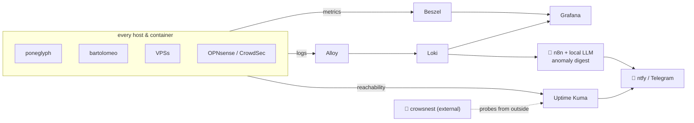
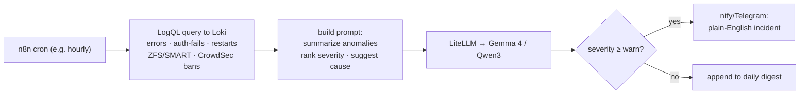

# 09 · Observability — Monitoring, Dashboards, Logging, LLM Anomaly Detection

Right-sized for a 16→32 GB NAS: **featherweight by default**, with a full metrics/log pipeline where it earns its keep.

| Service | Version (Jul 2026) | Role | Docs |
|---|---|---|---|
| **Homepage** | 1.13.2 | Single front door + live service widgets | [gethomepage.dev](https://gethomepage.dev/) |
| **Uptime Kuma** | 2.4.0 | Uptime/status of every service + notifications | [github.com/louislam/uptime-kuma](https://github.com/louislam/uptime-kuma) |
| **Beszel** | 0.18.7 | Lightweight host/Docker metrics (hub+agent) | [beszel.dev](https://beszel.dev/) |
| **Grafana** | 13.1.0 | Dashboards for metrics + logs | [grafana.com/docs](https://grafana.com/docs/) |
| **Loki** | 3.7.3 | Log aggregation (label-indexed) | [grafana.com/docs/loki](https://grafana.com/docs/loki/latest/) |
| **Alloy** | 1.17.1 | Log/metric collector (ships to Loki) | [grafana.com/docs/alloy](https://grafana.com/docs/alloy/latest/) |
| **ntfy** | 2.13.x | Push notifications to phones | [docs.ntfy.sh](https://docs.ntfy.sh/) |

> [!NOTE]
> **Why not Prometheus+Grafana everywhere / Netdata / Graylog / SigNoz?** All excellent, all heavier. On a 16→32 GB box already running ~20 containers, **Beszel + Uptime Kuma** cover 90% of "is it up, is it hot" at a tiny footprint, and **Loki+Alloy** give real centralized logs without Graylog's Elasticsearch/OpenSearch RAM appetite or SigNoz's full-APM weight. Prometheus is added later only if you need PromQL alerting on custom metrics.

## The pipeline

- **`crowsnest`** runs an *external* Uptime Kuma/Gatus so you learn about an outage the way your family does — from outside the house. It also watches the **tunnel/`puffingtom` liveness** (early warning if Oracle reclaims the free instance → trigger the [fallback runbook](10-external-access.md#tunnel-resilience--provider-fallback)) and flags a **stale config-backup** if no commit has landed in N days.
- **Homepage** is the human landing page (`home.sunny.home`) with live widgets (Jellyfin now-playing, *arr queues, disk, CPU) and links to every service by name.

## LLM-based anomaly / issue detection

The interesting portfolio piece: logs land in **Loki**; a scheduled **n8n** job queries them and asks the **local LLM** ([08](08-ai-llm.md)) to reason over them — no cloud, no per-token cost.

What it catches in practice: a container crash-looping, a spike in failed logins, a ZFS pool going `DEGRADED` or a SMART pre-fail, CrowdSec ban storms, a cert about to expire, a disk filling up. The LLM turns a wall of log lines into *"`ct-media` Jellyfin restarted 6× in 20 min after a plugin update — likely the update; consider rollback"* and pushes it to your phone. Keep it **advisory** (it summarizes and suggests; it doesn't auto-remediate) and always attach the raw LogQL link so you can verify.

> [!TIP]
> Start with deterministic alerts (Uptime Kuma down-checks, ZFS/SMART, cert expiry) — those must never depend on the LLM. Layer the LLM digest **on top** as the "what's weird lately?" analyst, not as the primary alarm.

## Dashboards to build first
1. **Fleet health** (Beszel): CPU/RAM/temp/disk per host — spot the 32 GB pressure on `poneglyph`.
2. **Storage** (Grafana): ZFS capacity, ARC hit-rate, scrub status, SMART.
3. **Security** (Loki): CrowdSec decisions, Authelia auth events, WireGuard handshakes.
4. **Media** (Homepage widgets): queues, transcodes, now-playing.

Next: **[10 · External access →](10-external-access.md)**
