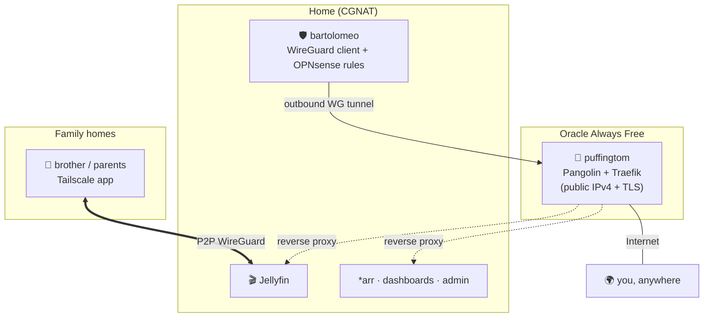

# 10 · External Access — Family Jellyfin for ₹0/month

The hard requirement: family (brother, parents) at *other houses* watch Jellyfin, and you admin everything from anywhere — **no recurring cost**, behind **JIO CGNAT** (no public IPv4, so port-forwarding is dead on arrival).

## The three-line answer
1. **Family → Jellyfin: Tailscale** (free). Peer-to-peer WireGuard, full home-upload bandwidth, zero ToS risk. Family installs one app.
2. **You → everything / portfolio-grade public reach: Pangolin + Newt on `puffingtom`** (Oracle free VPS) over an outbound WireGuard tunnel. Owns the whole pipe; no third party's goodwill required.
3. **❌ Not Cloudflare Tunnel for video** — it's against Cloudflare's ToS and *actively enforced* in 2026.

## Comparison (why the picks)

| Approach | Ver (Jul 2026) | Beats CGNAT | Jellyfin video | Family install | $/mo | Notes |
|---|---|:--:|:--:|:--:|:--:|---|
| **Tailscale** ✅ family | free Personal | ✅ | ✅ P2P, full bw | app on each device | ₹0 | **6 users / unlimited devices** since Apr 2026 |
| **Pangolin + Newt** ✅ admin | 1.20.0 / 1.13.x | ✅ | ✅ no ToS issue | none (browser link) | ₹0 | GUI + SSO; cap RAM (leak workaround) |
| Self-host WireGuard + Caddy on VPS | WG 1.0.2026 | ✅ | ✅ | none | ₹0 | The "boring/robust" DIY version of Pangolin |
| Cloudflare Tunnel | 2026.6.x | ✅ | ❌ **ToS-blocked** | none | ₹0 | Fine for dashboards/*arr **only**, not media |
| Headscale / NetBird | 0.28 / 0.7x | ✅ | ✅ | app on each device | ₹0 | Good "extra credit"; unnecessary here |

> [!WARNING]
> **Cloudflare Tunnel + Jellyfin = don't.** Cloudflare's Service-Specific Terms (current, updated Jun 2026) require paid Stream/Enterprise to serve video via the CDN; 2026 reports show real subdomain suspensions at ~50 GB/mo of video. Use CF Tunnel, if at all, only for lightweight dashboards.

## Primary: Tailscale for family
- Install Tailscale on the **Jellyfin host** and on each family **device** (phone/laptop/TV app; router subnet-route for TVs without a client).
- Traffic is **direct P2P WireGuard at full home-upload speed**; Tailscale isn't a CDN, so no ToS problem.
- Add the Tailscale CGNAT range `100.64.0.0/10` to Jellyfin's `LocalNetworkSubnets` so it doesn't throttle "remote" playback.
- **Catch:** if a relative's ISP does symmetric NAT, Tailscale falls back to a DERP relay (slower); check `tailscale status` shows a *direct* connection for 4K.

## Secondary / portfolio: Pangolin + Newt on `puffingtom`
- **`bartolomeo` initiates an outbound WireGuard tunnel** to `puffingtom` (CGNAT blocks inbound, never outbound). `PersistentKeepalive = 25`.
- **Pangolin** (Traefik-based, GUI + SSO + per-resource rules) publishes chosen services on a real domain with auto-TLS. It's "Cloudflare Tunnel, self-hosted and ToS-free."
- OPNsense firewall rule limits the tunnel to **only** the specific service IPs/ports — a compromised VPS can't roam the LAN. Step-by-step home-side config: [runbook 02](runbooks/02-opnsense-wireguard.md).

> [!WARNING]
> **Pangolin memory leak on tiny VPS:** cap the container (`mem_limit: 700m`, `restart: unless-stopped`). With Oracle's post-Jun-2026 **2 OCPU / 12 GB** free ceiling shared across `puffingtom`+`crowsnest`, set this deliberately.

**Set MTU 1280–1380** on the WireGuard interface — the #1 silent cause of "tunnel connects but streaming stalls" (PMTU black-holes on CGNAT/VPS paths).

## DNS, domain & TLS
- **$0 path:** DuckDNS (free, 5 subdomains) + Let's Encrypt (HTTP-01 on the VPS, which *has* a public IP) — fully automatic via Pangolin/Caddy.
- **~₹900/yr polish:** a real `.com`/`.in` domain for `media.yourname.com` etc. Purely cosmetic; not required.
- Trust `X-Forwarded-For` from the tunnel so Jellyfin logs (and fail2ban/CrowdSec) see real client IPs.

## Security for anything public (via `puffingtom`)
- Only 80/443 + WireGuard UDP open on the VPS; **SSH key-only, non-standard port**.
- **CrowdSec** (+ Traefik bouncer) and **fail2ban** as defense-in-depth; **Authelia** MFA in front of admin surfaces (Jellyfin keeps its own login).
- **Geo-block to India** at the edge (allow exceptions for a traveling relative, or just rely on Tailscale for them).
- Unattended security updates on the VPS.

## Tunnel resilience — provider fallback

> [!WARNING]
> `puffingtom`/`crowsnest` sit on Oracle **Always Free**, which can reclaim "idle" instances or change tier limits without notice (it *halved* the ARM allocation in Jun 2026). If Oracle pulls the plug, external reach dies with it — so the design treats the VPS as **replaceable, not sacred**.

**Why this is low-risk:** the tunnel stack (Pangolin + Newt, or WireGuard + Caddy) only needs a box with **a public IPv4 and SSH**. It's entirely provider-agnostic — nothing about it is Oracle-specific.

**Keep a rebuild kit in the encrypted git repo:** a `cloud-init`/Ansible playbook + the Newt/WireGuard config + the Caddy/Pangolin compose. That kit is built and lives in [`deploy/`](../deploy/), with a step-by-step [rebuild runbook](runbooks/00-tunnel-rebuild.md) and [provider notes](runbooks/01-provider-notes.md). Rebuilding `puffingtom` on a fresh VPS is then a ~15-minute job — spin the box → paste cloud-init → run the playbook → repoint DNS → done.

**Cheap paid fallbacks (July 2026)** — documented insurance, *not* a cost you pay while Oracle works:

| Provider | ~Price | Specs | IPv4 | Notes |
|---|---|---|:--:|---|
| **RackNerd** | **~$11–22/yr** | 1 vCPU / 1 GB / 20 GB | ✅ 1 incl. | Cheapest reliable; price-locked renewals; 20+ DCs — ideal for a pure tunnel node |
| **Hetzner** CX22 | ~€3.29/mo | 2 vCPU / 4 GB / 40 GB NVMe | ✅ 1 | Best all-rounder; great API/automation |
| **Netcup** VPS 1000 | ~€3.99/mo | 2 vCPU / 8 GB / 256 GB | ✅ | EU value; snapshots |
| IONOS | ~$2/mo | 1 vCPU / 1 GB | ✅ | Ultra-cheap monthly |

For a tunnel that only relays traffic, **RackNerd at ~$1–2/month-equivalent** is plenty and keeps the whole external-access story alive if Oracle ever disappears. `crowsnest` watches `puffingtom` and alerts the moment it goes dark, so you trigger the rebuild on your terms.

> **Bottom line:** the **$0 baseline stays $0**. The fallback is a written runbook plus a ~₹1,000–1,800/yr option you can execute in 15 minutes — resilience, not a recurring bill.

## The real bottleneck: your **upload** speed
Whether P2P (Tailscale) or via the VPS, media still leaves home once. `max concurrent streams ≈ (home upload Mbps × 0.8) / per-stream bitrate`. **Measure upload from the server**, then set Jellyfin's Dashboard → Playback **internet bitrate cap ≈ 70% of upload**. This single setting prevents most "buffering for grandma" complaints — the VPS/egress (10 TB/mo) is *not* the constraint; your JIO upstream is.

Next: **[11 · Security & ops →](11-security.md)**
