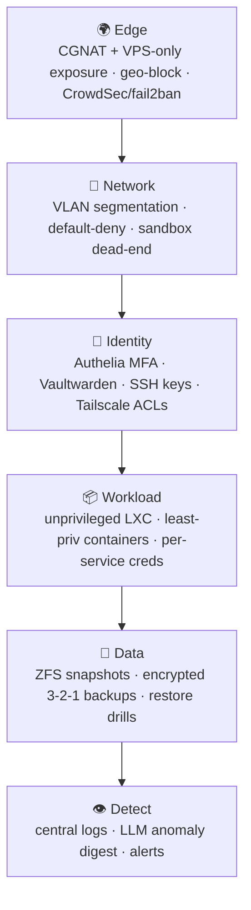

# 11 · Security & Operations

## Defense in depth



Each layer is documented where it lives: [edge/tunnel](10-external-access.md), [VLANs/firewall](02-network.md), [identity](05-core-services.md), [workload sizing](03-virtualization.md), [backups](04-storage.md), [detection](09-observability.md). This page ties them together and covers **secrets** and **patching**.

## Threat model (home-scale, honest)
| Threat | Mitigation |
|---|---|
| Opportunistic internet scans | No inbound at CGNAT; VPS exposes only 80/443+WG; CrowdSec/geo-block |
| Compromised IoT/TV device | VLAN 40 can't reach LAN or Mgmt; internet-only |
| Malware detonated in the lab | VLAN 60 dead-end, no LAN route, internet off by default ([13](13-impeldown-labs.md)) |
| Credential stuffing on shared apps | Authelia MFA on admin; per-user accounts; Vaultwarden strong passwords |
| Exploit in the web/identity tier (Caddy/Authelia) | Runs in an **unprivileged `ct-proxy` LXC**, not on the firewall — blast radius contained; snapshot + redeploy to recover |
| Drive failure / bit rot | ZFS mirror + scrub + SMART alerts |
| Ransomware on live data | Immutable/pull-based backups (PBS + restic), off-site copy, snapshots |
| VPS takeover | Narrow tunnel firewall rule — VPS can reach only Jellyfin's IP:port, nothing else |

## Secrets management
- **Vaultwarden** = human/family password vault + shared app logins.
- **Infrastructure secrets** (compose `.env`, API tokens, WG keys) live in a **private** git repo encrypted with **SOPS + age** — never in this public repo (see [`.gitignore`](../.gitignore)). Decrypt on-host at deploy time.
- **Rotate** the debrid/Telegram/API tokens the automations use; scope them minimally.
- Proxmox/OPNsense/switch admin creds are MFA-gated and unique.

## Break-glass / offline credentials

> [!WARNING]
> **Vaultwarden must not be the only copy of the passwords you'd need to fix a dead network.** If `poneglyph`/`ct-proxy`/DNS are down, Authelia and Vaultwarden are down with them — and you can't log in to fix anything. Classic chicken-and-egg lockout.

Keep an **offline, network-independent** copy of the *core infrastructure* secrets:

| Secret | Why it's break-glass |
|---|---|
| Proxmox `root` (`poneglyph`) | Fix the hypervisor when the web UI/SSO is down |
| OPNsense `root` / console | Fix routing/DNS/firewall from the console |
| ZFS + off-site backup passphrases | Without them, backups are unrecoverable |
| `ct-proxy`/Authelia bootstrap + Vaultwarden admin token | To rebuild the identity tier itself |
| Domain/DuckDNS + `puffingtom` VPS login | To restore external access |

**Where:** an encrypted **KeePassXC** file on a couple of local laptops (synced by hand, *not* via the lab) **and** a printed copy in a physical safe. Update it whenever these rotate, and **test the path once** — can you get a Proxmox console and unlock ZFS using only the offline copy? Everything *else* (family logins, app API keys) stays in Vaultwarden.

## Configuration backup & change management

Every device's config is versioned into the **SOPS/age-encrypted private git repo** so a dead box is a *restore*, not a rebuild-from-memory.

| Target | Method | Notes |
|---|---|---|
| `bartolomeo` (OPNsense) | **Native `os-git-backup` plugin** → private Forgejo repo | Commits `config.xml` on every change + nightly push (SSH deploy key to a *blank* repo). `Backups → Nextcloud` is the zero-plugin alternative — both are built in. |
| `sabaody` / `waterseven` (TL-SG108E/105E) | **Semi-manual export** → commit to git | ⚠️ Web-UI-only (no SSH/API) — no clean automation. Export the config file from the UI after each VLAN change and commit it. Optional: a scheduled Playwright script that logs in and downloads the backup. |
| Future SSH/Telnet gear (managed APs, bigger switches) | **oxidized** (LXC/Docker) | RANCID replacement, 130+ device types, ~4 h poll, **Git / Git-Crypt** output → Forgejo. Only worth running once you own devices it can actually log into — it can't touch the current web-UI-only switches. |
| Proxmox / host `/etc` | git (per-host) + PBS | PBS covers VMs/CTs; `/etc` in git catches host tweaks. |

> [!TIP]
> Have `crowsnest` watch the config-backup repo and **alert if no commit has landed in N days** — a silently-failed backup is the one you discover at the worst possible moment. The TL-SG108E VLAN-1 footgun ([doc 02](02-network.md)) is exactly the kind of change you want captured the instant it's made.

## Patching & upgrades — "how easy is rollout?"

**Short answer: easy and low-risk, because everything is snapshotted and staged.** Nothing here auto-updates into production blind.

```mermaid
flowchart LR
    WATCH["What's Up Docker / Renovate<br/>(notify only)"] --> SNAP["ZFS/Proxmox snapshot"]
    SNAP --> STAGE["update one stack"]
    STAGE --> VERIFY{healthy?<br/>(Uptime Kuma + logs)}
    VERIFY -->|yes| KEEP["keep · note version in doc 16"]
    VERIFY -->|no| ROLL["rollback snapshot (seconds)"]
```

| Layer | Tool | Cadence | Rollback |
|---|---|---|---|
| Host OS (Proxmox/Debian/OPNsense) | `apt`/OPNsense updater; **unattended-upgrades** for security only | security: auto; features: monthly window | boot previous kernel / OPNsense restore point |
| Containers (compose) | **What's Up Docker** (notify) → pinned tag bump via Dockge/Git | monthly, staged per stack | re-deploy previous tag; ZFS snapshot |
| VMs/CTs | Proxmox snapshot before any change | before each update | Proxmox rollback (seconds) |
| Config | Git (per-host, SOPS-encrypted) | every change | `git revert` |

**Principles**
- **Pin versions**, don't chase `:latest`. The version matrix ([16](16-versions.md)) is the source of truth; a bump is a deliberate, logged change.
- **Avoid blind Watchtower auto-pull.** Use a *notify-only* watcher; humans (or a Renovate PR you approve) trigger updates. Media/DB apps especially can ship breaking migrations (Immich 3.0, Paperless 3.0-rc, Jellyfin 12 are exactly the kind you upgrade *deliberately*).
- **Snapshot → update one stack → verify via Uptime Kuma + the LLM log digest → keep or roll back.** Because guests are small and grouped by domain, a bad update affects one stack, not the house.
- **Read release notes for majors.** Cross-reference breaking-change flags noted in [16](16-versions.md) (Immich 3.x, Paperless 3.x, Jellyfin 12, Nextcloud Hub majors).

## Operational routines
- **Weekly:** ZFS scrub result, backup success, **config-backup freshness** (last commit landed), CrowdSec/Authelia review (auto-digested by the [LLM analyst](09-observability.md)).
- **Monthly:** staged updates; check [16](16-versions.md) for majors; test one restore.
- **Quarterly:** full restore drill; rotate a secret; review firewall rules for drift.

Next: **[12 · Automation →](12-automation.md)**
