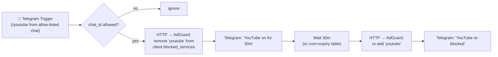
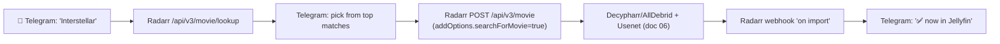
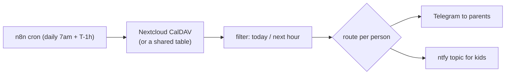

# 12 · Automation (`ct-automation`)

Engine: **n8n** (1.117.x, self-hosted CE — free for home use under the Sustainable Use License). [docs.n8n.io](https://docs.n8n.io/). Push via **ntfy**/Telegram. n8n calls the [local LLM](08-ai-llm.md) where useful.

## 1) Telegram "YouTube for 30 minutes" toggle

Goal: you/your wife send a Telegram message → YouTube unblocks for 30 min → auto re-blocks.

**AdGuard Home API** ([OpenAPI spec](https://github.com/AdguardTeam/AdGuardHome/tree/master/openapi)) — auth via `POST /control/login`, then:
- Per-client (recommended): `GET /control/clients` → read the child device's `blocked_services.ids`; `POST /control/clients/update` with `use_global_blocked_services:false` and `youtube` removed/re-added.
- Or global: `GET /control/blocked_services/get` + `PUT /control/blocked_services/update`.

> [!WARNING]
> **DNS blocking of YouTube is leaky.** The `youtube` *blocked-service* entry (which bundles `googlevideo.com`, `ytimg.com`, etc.) is far better than blocking `youtube.com` alone, but the mobile/TV **app** can use its own DoH/hardcoded resolvers and slip past router DNS. Do it **per-client** (only the kid's device), force that client's DNS through AdGuard, and accept that the browser is easy to gate while the native app may need device-level controls too.

> [!TIP]
> **More robust than a 30-min `Wait`:** store an `unblock_expires_at` timestamp in a small table (NocoDB/Postgres); a separate n8n cron (every 1–5 min) re-blocks anything expired. This survives n8n restarts/updates and supports an instant "re-block now" command.

## 2) Request a movie by Telegram → it lands in Jellyfin

- **Recommended:** Telegram → **n8n → Radarr API** for the chat-native "just type a name" flow, with a confirm step so ambiguous titles don't add the wrong film. Reserve **Seerr** as the polished app for family requests/approvals ([06](06-media-stack.md)).
- The Radarr **import webhook** closes the loop so the requester learns it's watchable, not just queued.

## 3) Family event reminders

- Source of truth = **Nextcloud Calendar** (CalDAV `REPORT`) so the whole family already edits it; a NocoDB table is the low-friction alternative.
- "On June 30th there's a function" becomes an event → a T-1-day and morning-of nudge to the right people. The same pattern drives booking confirmations for the [lakeside site](14-sites-social.md).

## Other high-value automations
- **Backup/scrub/cert reports** → ntfy (deterministic) + the [LLM anomaly digest](09-observability.md).
- **New media announcements** → a family Telegram channel when something they requested arrives.
- **"Guest Wi-Fi password of the week"** rotation + a printable QR to the fridge.
- **Paperless intake**: email-to-Paperless + [LLM auto-tagging](08-ai-llm.md#paperless-ngx-ai).

> Instagram/YouTube *content* automation (and why engagement pods are off the table) is its own topic — see **[14 · Sites & Social](14-sites-social.md)**.

Next: **[13 · impeldown labs →](13-impeldown-labs.md)**
