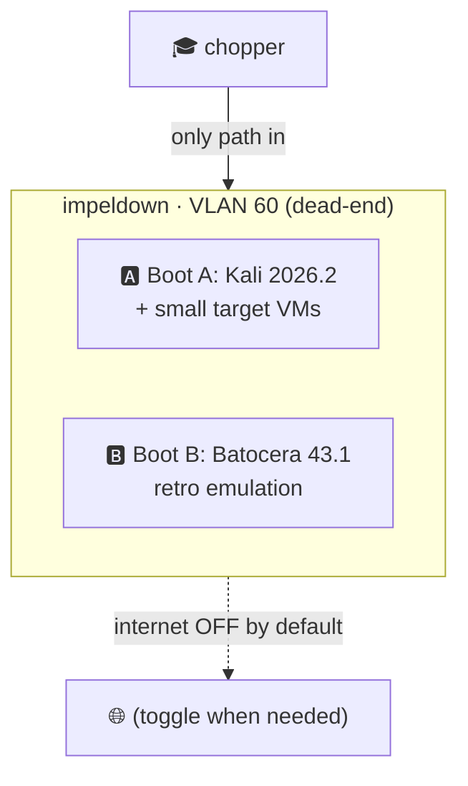

# 13 · `impeldown` — Cyber Sandbox + Retro Emulation

Beelink SER5 (Ryzen 7 5800H, Vega 8 iGPU, 16 GB, 500 GB SSD). **Dual-boot**, **isolated on VLAN 60**, reachable **only from `chopper`** ([02](02-network.md#sandbox-isolation--the-exact-rule)).

## Why dual-boot (not nest one under the other)
With **16 GB RAM and no discrete GPU to pass through**, running both workloads well at once isn't realistic. Bare-metal each side gets the full 16 GB and the iGPU:
- **Boot A — Cyber Sandbox:** Kali Linux host + lightweight throwaway target VMs.
- **Boot B — Retro:** Batocera (emulation gets the whole iGPU, no virtualization tax).

## Boot A — Cybersecurity lab

| Tool | Version (Jul 2026) | Role | Docs |
|---|---|---|---|
| **Kali Linux** | 2026.2 | Attacker workstation (native) | [kali.org/docs](https://www.kali.org/docs/) |
| **Metasploit Framework** | current | Exploitation framework | [docs.metasploit.com](https://docs.metasploit.com/) |
| Target VMs | — | DVWA, Metasploitable, VulnHub boxes (throwaway) | — |

- **TryHackMe / HackTheBox / picoCTF** are cloud platforms — you just need a **browser + OpenVPN** from Kali. Near-zero local resource cost. This is where most structured learning happens.
- Run **Kali natively** (not in a VM) for performance; spin **small, disposable target VMs** in KVM/VirtualBox as needed and snapshot/delete them.

> [!WARNING]
> **Big AD labs won't fit.** **GOAD / GOAD-Light** officially want **20–32 GB** RAM — not viable on 16 GB. **DetectionLab is sunset (2023)** — don't build on it. If you later want a full Active-Directory range, that's a job for a 32–64 GB box (a future `chopper`/`pluton`-class machine or a Proxmox range), not `impeldown`.

**Isolation is the whole point:** VLAN 60 has **no route to any other VLAN**, and **internet is off by default** — flip an OPNsense alias/schedule only when a task needs it, so a detonated sample can't phone home or pivot. Only `chopper` can SSH/RDP in.

## Boot B — Retro gaming & emulation

**Is the 5800H good enough?** For everything up to the 7th generation, **yes**. For PS3/PS4/Switch on a Vega 8 iGPU, **no** — and the docs won't pretend otherwise.

| System | Emulator | Verdict on Vega 8 |
|---|---|---|
| NES/SNES/Genesis/GB/GBA | RetroArch cores | ✅ Flawless |
| PS1 / N64 / Dreamcast | DuckStation / Mupen / Flycast | ✅ Great |
| PSP | PPSSPP | ✅ Great |
| PS2 | PCSX2 | ✅ Good (occasional heavy title dips) |
| GameCube / Wii | Dolphin | ✅ Good (mid settings) |
| **PS3** | RPCS3 | ⚠️ **Poor** — wants a discrete Vulkan GPU |
| **PS4** | shadPS4 | ❌ **No** — early-stage + far beyond an iGPU |
| **Switch** | Eden (post-Yuzu/Ryujinx) | ❌ **No** — demanding + legally fraught |

**Frontend: Batocera 43.1** ([batocera.org](https://batocera.org/)) — boots straight to a couch-friendly UI, great controller support, tidy ROM/BIOS layout. (EmuDeck/RetroBat/Bazzite are fine alternatives; Batocera is the cleanest for a dedicated box.)

> [!NOTE]
> When you want PS3-era emulation, that's a job for a machine with a **discrete GPU** — e.g. `chopper` (RTX 2070 Super) today, or the future `pluton`. `impeldown` owns the huge, well-emulated retro back-catalog; the heavy hitters live on a box with a real GPU. Keep ROMs/BIOS to titles you legally own.

Next: **[14 · Sites & Social →](14-sites-social.md)**
