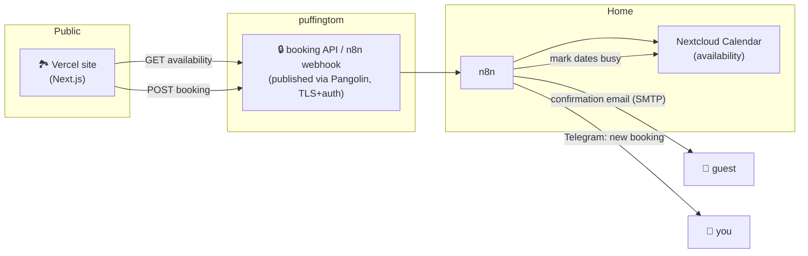
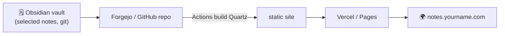

# 14 · Sites & Social

Three outward-facing projects: a **lakeside booking site**, a **published-notes site**, and **social growth** for the lakeside brand — with an honest line on what's allowed.

## 1) Lakeside property site + availability ↔ Nextcloud

Host the marketing/booking site on **Vercel** (fast, free tier, CDN, no home exposure). The site needs to **read availability** and **mark dates unavailable** against your **Nextcloud Calendar** (the single source of truth), with n8n sending mail confirmations.

- **Don't expose Nextcloud directly.** The site talks to a **small booking API / n8n webhook** published through the [`puffingtom` tunnel](10-external-access.md) with TLS + a shared secret/token — home stays behind CGNAT.
- **Flow:** site queries availability (n8n reads CalDAV) → guest submits → n8n creates the calendar event (dates become unavailable), emails the guest (SMTP), and pings you on Telegram. A T-1-day reminder reuses the [reminders workflow](12-automation.md).
- **Double-booking guard:** treat Nextcloud as authoritative; n8n rejects overlapping requests atomically. Optionally mirror to a channel-manager later if you list on OTAs.

## 2) Published-notes site (Obsidian markdown → web)

**Quartz** (v5, [quartz.jzhao.xyz](https://quartz.jzhao.xyz/)) is the best Obsidian pairing — it natively understands wikilinks, callouts, transclusions, and Obsidian's link-resolution, with graph view + backlinks.

- Keep a **publish** folder (or a `publish: true` frontmatter filter) so only chosen notes go public.
- Build on push via **Forgejo Actions** (or GitHub Actions) → deploy to Vercel/Pages. Zero home exposure, ₹0 hosting.
- Alternatives: **Flowershow** (no-git one-click publish), **Perlite** (self-hosted, point-at-vault) — Quartz wins for a git-driven portfolio.

## 3) Instagram / YouTube growth — the honest version

> [!WARNING]
> **Engagement pods, and automated likes/comments/follows, violate Instagram's and YouTube's Terms of Service** and risk shadowbans or permanent bans — enforcement got *stricter* through 2025–2026. This project **does not** build or run audience-manipulation automation. Don't.

**What to automate instead (ToS-safe, and genuinely effective):**

| Layer | Tool | What it does |
|---|---|---|
| Scheduling / cross-post | **Postiz** (v2) or **Mixpost** (v2 Lite) — self-hosted | Plan & publish Reels/Shorts/posts across accounts via official APIs |
| Content assist | **n8n + local LLM** ([08](08-ai-llm.md)) | Draft captions, hashtag sets, titles/descriptions from a clip or topic |
| Repurposing | n8n + `ffmpeg` | Long video → Reels/Shorts cuts → queue into Postiz/Mixpost |
| Analytics | official Insights/Analytics APIs → n8n → Grafana | Track what actually performs; post at real best-times |
| Community | n8n triage | Surface new comments/DMs to a Telegram channel for a *human* reply |

Postiz: [docs.postiz.com](https://docs.postiz.com/) · Mixpost: [mixpost.app/docs](https://mixpost.app/docs). Growth comes from **consistent, well-timed, well-produced posting** — which this pipeline makes cheap — not from fake engagement.

Next: **[15 · Roadmap & shopping →](15-roadmap.md)**
