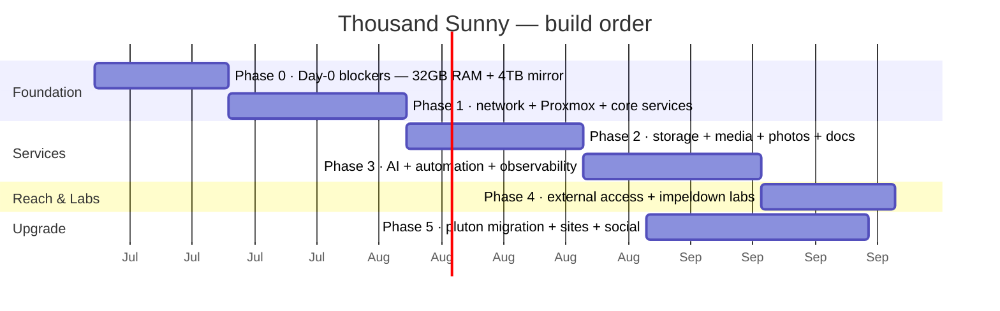

# 15 · Roadmap, Limitations & Shopping

## Phased rollout

> [!IMPORTANT]
> **Phase 0 items are Day-0 blockers, not deferrable prep.** The 32 GB RAM and the 2nd 4 TB mirror must be in place before real data/services land on `poneglyph`; `waterseven` must exist before `impeldown` comes online (Phase 4).

| Phase | Goal | Key docs |
|---|---|---|
| **0 · Day-0 blockers** | 🔴 2nd 16 GB (→32 GB) + 2nd 4 TB (→mirror) on `poneglyph` *before go-live*; `waterseven` before `impeldown`; update `sabaody` firmware; label cables; buy UPS | [01](01-fleet.md), [04](04-storage.md) |
| **1 · Foundation** | OPNsense + VLANs + DNS + Caddy + Authelia/Vaultwarden on `bartolomeo`; Proxmox + ZFS mirror on `poneglyph` | [02](02-network.md), [03](03-virtualization.md), [05](05-core-services.md) |
| **2 · Services** | Media stack, Immich, Paperless, Kavita, Navidrome, Nextcloud, Forgejo | [06](06-media-stack.md), [07](07-productivity.md) |
| **3 · Intelligence** | LLM serving on `vegapunk` + LiteLLM; wire Immich/Paperless AI; monitoring + central logs + LLM digest; n8n automations | [08](08-ai-llm.md), [09](09-observability.md), [12](12-automation.md) |
| **4 · Reach & Labs** | Tailscale + Pangolin on `puffingtom`; family Jellyfin; `impeldown` dual-boot | [10](10-external-access.md), [13](13-impeldown-labs.md) |
| **5 · Upgrade** | `pluton` build + migration; lakeside + notes sites; social pipeline | below, [14](14-sites-social.md) |

## `pluton` migration (~2 months out)

When the 9800X3D / R9700 32 GB build lands:
1. **Stand up `pluton`** as the new LLM server (Pop!\_OS + llama.cpp/Ollama, later vLLM). Add it to LiteLLM as a second backend.
2. **Cut over** the `local-chat` alias to prefer `pluton`; keep `vegapunk` as failover.
3. **Relocate `vegapunk`** (the 265K + 5070 Ti machine) to the ground floor as your daily desktop + backup inference node — **it keeps the name**.
4. Re-point `chopper`'s old role as needed; the freed 3700X parts become a spare Proxmox node or retire.
5. If a **second R9700** arrives later → 64 GB VRAM unlocks 80B-class MoE models ([08](08-ai-llm.md)).

No service rename, no client reconfig — everything still points at `litellm.sunny.home`.

## Main limitations (know these going in)

| # | Limitation | Impact | Mitigation |
|---|---|---|---|
| 1 | **`poneglyph` 16 GB RAM** | Can't run ~20 containers + ZFS ARC safely; Immich/Nextcloud jobs OOM | ➕ 2nd 16 GB → **32 GB** — 🔴 **Day-0 blocker** |
| 2 | **Single 4 TB HDD** | No redundancy — one failure = data loss | ➕ 2nd 4 TB → **ZFS mirror** — 🔴 **Day-0 blocker** |
| 3 | **JIO CGNAT, no public IPv4** | No port-forwarding | Tailscale + VPS tunnel ([10](10-external-access.md)) |
| 4 | **`vegapunk` 16 GB VRAM** | Caps below dense-32B / big coding MoE | `pluton` 32→64 GB later ([08](08-ai-llm.md)) |
| 5 | **`impeldown` Vega 8 iGPU + 16 GB** | No PS3/PS4/Switch; no big AD labs | Heavy emulation on a dGPU box; cloud CTF platforms |
| 6 | **`bartolomeo` only 2 NICs** | One WAN + one LAN trunk | Fine — VLANs on `sabaody` do the rest |
| 7 | **`sabaody` 8 ports** | TV-room + 2 risers fill it | Add a small VLAN switch in the hall (needed anyway for `impeldown` isolation) |
| 8 | **`denden` AC1750 not VLAN-aware (stock)** | Untagged mgmt would leak to Wi-Fi; `vegapunk` VLAN-20 tags dropped | Flash OpenWrt (recommended), add an upstairs switch, or access-port VLAN 30 ([runbook 05](runbooks/05-switch-vlan-config.md#the-denden-ap-trunk-trap)) |
| 9 | **Oracle free tier volatility** (halved Jun 2026; can reclaim idle) | 2 OCPU/12 GB; risk of losing the tunnel entirely | Cap Pangolin RAM; keep roles lean; **provider-agnostic fallback to RackNerd/Hetzner + 15-min rebuild kit** ([10](10-external-access.md#tunnel-resilience--provider-fallback)) |
| 10 | **Home upload speed** | Real cap on concurrent remote streams | Measure; set Jellyfin bitrate cap ~70% ([10](10-external-access.md)) |
| 11 | **`poneglyph` boot NVMe (`rpool`) SPOF** | NVMe death = hypervisor down (bare-metal restore) | Mirror `rpool` with a 2nd SSD, or accept ~1–3 h RTO ([04](04-storage.md), [runbook](runbooks/03-proxmox-bare-metal-restore.md)) |

## Shopping list (India, July 2026)

> [!WARNING]
> **RAM/NAND prices are rising** (DRAM +13–18% QoQ Q3'26, some vendors warn 20–40%; no relief expected before ~2028). **Buy RAM/SSD sooner, not later.**

| Priority | Item | Suggested part | ~Price (INR) |
|:--:|---|---|---:|
| 🔴 P1 · Day-0 | RAM for `poneglyph` 16→32 GB | Crucial CT16G56C46S5 (DDR5-5600 SODIMM) | ₹5,300–6,500 |
| 🔴 P1 · Day-0 | 2nd NAS drive (mirror) | Seagate IronWolf ST4000VN006 *or* WD Red Plus WD40EFPX | ₹9,000–11,500 |
| 🟠 P2 | Hall VLAN switch `waterseven` — enables `impeldown` isolation | TP-Link TL-SG105E (or 2nd TL-SG108E) | ₹1,500–2,000 |
| 🟢 P3 | Upstairs VLAN switch `skypiea` — only if NOT flashing `denden` to OpenWrt (Option B) | TP-Link TL-SG105E | ₹1,500–2,000 |
| 🟠 P2 | UPS for NAS + network | APC BX600I-IN (600 VA) or BR1000G-IN (1000 VA) | ₹2,700–12,400 |
| 🟢 P4 | Extra NVMe (appdata headroom) | WD Black SN7100 / Crucial P310 1 TB | ₹15,700–22,000 |
| 🟢 P4 | Off-site backup disk | External 4 TB USB (rotate off-site) | ₹9,000–11,000 |
| 🟠 P2 | Boot-drive mirror — 2nd small SSD for `rpool` | 256–512 GB NVMe/SATA SSD | ₹1,800–3,500 |

**Where to buy / watch:** Amazon.in, MDComputers, PrimeABGB, Vedant Computers, TheITDepot (trusted, real warranties); **DesiDime** for deal alerts. Watch the **August Independence-Day sales** for the UPS/NVMe (not RAM — that's only going up). Buy the two NAS drives from **different batches/sellers** to avoid correlated failure.

Next: **[16 · Version matrix →](16-versions.md)**
