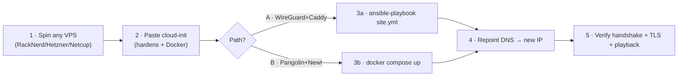

# Runbook · Rebuild the `puffingtom` edge tunnel (~15 min)

**When to run this:** Oracle reclaimed/changed the free instance, the VPS is unhealthy, or you're migrating providers. Goal: restore external reach (family Jellyfin fallback + admin + booking API) on a fresh VPS with **zero home reconfiguration** if keys are reused.

**Files:** everything referenced here lives in [`deploy/`](../../deploy/). Fill secrets from **Vaultwarden**/SOPS — never commit them.



## Pre-req (one-time): generate keys, store them
```bash
wg genkey | tee vps.key | wg pubkey > vps.pub     # VPS keypair
wg genkey | tee home.key | wg pubkey > home.pub    # home keypair
```
Put the four values in **Vaultwarden** (item: "Thousand Sunny · WireGuard"). Reusing the **same keys** on the new VPS means the home/OPNsense side needs no change — only the VPS public IP changes (and DNS follows).

## Step 1 — Spin a VPS
Ubuntu 24.04 image, smallest tier with a **dedicated IPv4**. See [provider notes](01-provider-notes.md). Note the public IP.

## Step 2 — Bootstrap (cloud-init)
Paste [`deploy/cloud-init/puffingtom.cloud-init.yaml`](../../deploy/cloud-init/puffingtom.cloud-init.yaml) as **user-data** (edit the `ssh_authorized_keys` line first). If the provider has no cloud-init field, SSH in and run the `runcmd` steps manually. Result: hardened box (SSH key-only on :2222, UFW, fail2ban) with Docker.

## Step 3a — Path A · WireGuard + Caddy (primary)
```bash
cd deploy/ansible
cp inventory.example.ini inventory.ini             # set ansible_host = new VPS IP
cp group_vars/edge.example.yml group_vars/edge.yml # fill domain, acme_email, wg_private_key (vault!), home_public_key, caddy_sites
ansible-galaxy collection install -r requirements.yml
ansible-playbook site.yml
```
This brings up `wg0` (VPS server) and Caddy (public TLS reverse proxy over the tunnel).

## Step 3b — Path B · Pangolin + Newt (alternative)
```bash
# on the VPS:
cd deploy/pangolin && cp ../.env.example .env      # fill DASHBOARD_DOMAIN etc.
docker compose up -d                               # pangolin + gerbil + traefik
# then register the site in the Pangolin dashboard, copy NEWT_ID/NEWT_SECRET,
# and on a home host: docker compose -f newt.docker-compose.yml up -d
```

## Step 4 — Home side (only if keys changed)
If you reused keys, skip. Otherwise, in **OPNsense → VPN → WireGuard**, update the peer's `Endpoint` to the new VPS IP (values in [`deploy/wireguard/home-peer.conf.example`](../../deploy/wireguard/home-peer.conf.example)); keep `PersistentKeepalive = 25`.

## Step 5 — Repoint DNS
Update the A record(s) (`jellyfin.example.com`, `book.example.com`, …) to the new VPS IP (or update DuckDNS). Caddy/Traefik auto-issues Let's Encrypt certs within a minute of DNS resolving.

## Verify
```bash
sudo wg show                     # a recent handshake + rising transfer = tunnel up
curl -I https://jellyfin.example.com   # 200/302 + valid TLS
# then: play something in Jellyfin from an external network
```
If streaming connects but **stalls**, lower the WireGuard **MTU to 1280–1380** (home side) — PMTU black-hole, the #1 gotcha.

## Rollback / notes
- Keep the previous VPS until the new one verifies, then destroy it.
- The whole edge is disposable: nothing stateful lives here except the (reusable) WG keys and the (auto-renewing) certs.
- **Family Jellyfin primary path is Tailscale** ([doc 10](../10-external-access.md)); this tunnel is the admin path + Jellyfin fallback + the booking-API endpoint, so a VPS outage degrades gracefully rather than cutting the family off.
