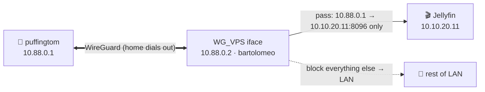

# Runbook · OPNsense home side — WireGuard tunnel, tunnel→Jellyfin rule, VLAN-60 sandbox, Servers routing

The home-side counterpart to the VPS [`deploy/`](../../deploy/) kit. Configures `bartolomeo` (OPNsense) to: dial the `puffingtom` tunnel outbound, let the VPS reach **only Jellyfin**, isolate the `impeldown` sandbox with a **1-hour auto-off** internet toggle, and route tunnel traffic into the Servers VLAN — all without turning the tunnel into a default gateway.

**Values** come from [`deploy/wireguard/home-peer.conf.example`](../../deploy/wireguard/home-peer.conf.example). Keep keys in Vaultwarden + the [break-glass](../11-security.md#break-glass--offline-credentials) copy.



## Part 1 · WireGuard client interface (outbound dial)

**VPN → WireGuard → Instances** — add the local instance:

| Field | Value |
|---|---|
| Name | `wg_vps` |
| Public/Private key | generate (or paste the `home` keypair from break-glass) |
| Listen port | *(leave default; we dial out)* |
| Tunnel address | `10.88.0.2/24` |
| Peers | select the peer below |

**VPN → WireGuard → Peers** — add `puffingtom`:

| Field | Value |
|---|---|
| Public key | *puffingtom's* public key |
| Endpoint address / port | `<VPS_PUBLIC_IP>` / `51820` |
| Allowed IPs | `10.88.0.0/24` |
| Persistent keepalive | `25` &nbsp;← **required behind CGNAT** |

Enable WireGuard (the checkbox on the instances tab), then:

- **Interfaces → Assignments:** assign the `wg0`/`wg_vps` device → name it **`WG_VPS`**, **Enable**. Leave **IPv4/IPv6 config type = None** (the tunnel address comes from the instance).
- **Do NOT set a gateway** on `WG_VPS` and don't make it a default route — we only want the tunnel used for the specific flows below, not all internet traffic.
- **MTU:** if remote playback connects but stalls, set the `WG_VPS` interface **MTU 1360** (drop toward 1280 on stubborn CGNAT/cellular paths) — the #1 silent failure.

Verify: `VPN → WireGuard → Status` shows a recent **handshake** and rising transfer once `puffingtom` is up.

## Part 2 · Narrow tunnel → Jellyfin firewall rule

Goal: a compromised VPS can reach **only** Jellyfin, nothing else on the LAN. Rules go on the **`WG_VPS`** interface (traffic entering from the tunnel), top to bottom:

| # | Action | Source | Destination | Port | Notes |
|---|---|---|---|---|---|
| 1 | **Pass** | `10.88.0.1` (VPS tunnel IP) | `10.10.20.11` (Jellyfin) | `8096` TCP | the only thing the VPS may reach |
| 2 | **Block** | `WG_VPS net` | `10.0.0.0/8` + `192.168.0.0/16` + `172.16.0.0/12` | any | no other LAN access from the tunnel |
| 3 | *(implicit deny)* | — | — | — | everything else dropped |

- Replies are stateful — no return rule needed.
- **Preserve real client IPs:** the VPS Caddy sets `X-Forwarded-For` (see [`deploy/caddy/Caddyfile.example`](../../deploy/caddy/Caddyfile.example)); trust it in Jellyfin so logs/fail2ban see the real client, not `10.88.0.1`.
- **Variant — hand off to the internal proxy instead of Jellyfin directly:** if you'd rather the VPS publish *several* services, point rule #1 at the **`ct-proxy` Caddy** (`10.10.20.9:443`) and let it fan out ([doc 05](../05-core-services.md)). Keep it equally narrow (single host, single port).

## Part 3 · VLAN-60 sandbox rules + 1-hour auto-off

Two interfaces are involved (OPNsense filters where traffic *enters*).

**On the Trusted interface (VLAN 30)** — who may open a session *into* the sandbox:

| # | Action | Source | Destination | Notes |
|---|---|---|---|---|
| 1 | **Pass** | `10.10.30.15` (`chopper`) | `10.10.60.0/24` | only chopper reaches `impeldown` |
| 2 | **Block** | `VLAN30 net` | `10.10.60.0/24` | no other trusted host may |

**On the Sandbox interface (VLAN 60)** — what the sandbox may do (traffic *from* it):

| # | Action | Source | Destination | Schedule | Notes |
|---|---|---|---|---|---|
| 1 | **Block** | `VLAN60 net` | `10.0.0.0/8`,`192.168.0.0/16`,`172.16.0.0/12` | — | dead-end: no pivot to any VLAN (incl. back to chopper) |
| 2 | **Pass** | `VLAN60 net` | `any` (internet) | `sandbox-online` | internet ONLY while the toggle/schedule is active |
| 3 | *(implicit deny)* | — | — | — | otherwise offline |

Result: `chopper` can open SSH/RDP *into* `impeldown` (stateful replies allowed), but `impeldown` can't initiate to the LAN, and has no internet unless rule #2 is active.

### Making rule #2 auto-off (pick one)

**A · Native Schedule (simplest).** *Firewall → Settings → Schedules →* create **`sandbox-online`** as a short time range and attach it to VLAN-60 rule #2. Outside the window the rule is inert. Trade-off: it's a fixed clock window, not "1 hour from when I flip it."

**B · On-demand 1-hour (n8n API).** Leave VLAN-60 rule #2 **disabled** by default; n8n enables it, waits 60 min, disables it (the [doc 12 workflow](../12-automation.md#4-sandbox-internet-auto-off)):
1. **System → Access → Users:** create a dedicated user (e.g. `n8n-fw`), generate an **API key/secret**, and give it only firewall privileges.
2. n8n calls (Basic-auth with key:secret):
   ```
   POST https://bartolomeo/api/firewall/filter/toggleRule/<RULE_UUID>
   POST https://bartolomeo/api/firewall/filter/apply
   ```
   Enable on the Telegram command, `Wait 60m`, then toggle back off.
3. **Fail-safe:** a 5-minute n8n cron asserts the rule is disabled outside any active window — so a crashed workflow can't leave the sandbox online.

> [!TIP]
> Use **B** for real work (grab a sample, detonate, done) and keep **A** as a backstop. Either way, a *forgotten* toggle can no longer leave malware a path to phone home.

## Part 4 · Routing tunnel traffic into the Servers VLAN

No static routes or NAT are needed — the Servers VLAN (`10.10.20.0/24`) is **directly connected** to OPNsense, so once the Part-2 pass rule permits `10.88.0.1 → 10.10.20.11:8096`, OPNsense routes it between the `WG_VPS` and `VLAN20` interfaces automatically. What makes it work end-to-end:

- **VPS side:** the peer's **Allowed IPs already include `10.10.20.0/24`** ([`deploy/wireguard/wg0.conf.example`](../../deploy/wireguard/wg0.conf.example)), so the VPS knows to send that subnet down the tunnel.
- **Home side:** the peer Allowed IPs stay `10.88.0.0/24` (return traffic to the VPS), and **no default gateway** is set on `WG_VPS`, so home internet keeps using the normal WAN — only the Jellyfin flow uses the tunnel.
- **Outbound NAT:** none for tunnel→LAN (same firewall, same RFC1918 space).

## Verify end-to-end
```bash
# On puffingtom:
sudo wg show                       # recent handshake + rising transfer
curl -I http://10.10.20.11:8096    # 200/302 through the tunnel → Jellyfin reachable
curl -I http://10.10.20.9          # should FAIL (rule #2 blocks non-Jellyfin LAN)
```
- From `chopper`: `ssh sandbox` works. From any other Trusted host: blocked.
- From `impeldown`: `ping 10.10.20.11` blocked; `curl https://example.com` fails until the toggle is on, and **fails again automatically within the hour**.

## If you're locked out
Console access to OPNsense uses the **break-glass** root password ([doc 11](../11-security.md#break-glass--offline-credentials)) — never depend on Vaultwarden/Authelia to fix the thing they run behind.
