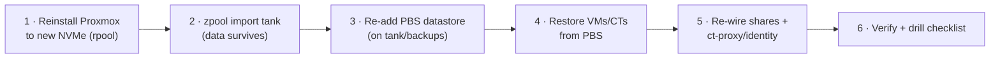

# Runbook · Proxmox bare-metal restore (`poneglyph`)

**When to run:** the boot/app NVMe (`rpool`) died, or the host is unbootable. Goal: back online from bare metal. **Prevention beats this runbook — mirror `rpool` with a 2nd SSD** ([doc 04](../04-storage.md)); if you did, a boot-disk failure is a hot-swap, not this procedure.

> **RTO: ~1–3 hours**, dominated by the guest restores from PBS. The **data pool (`tank`) survives** — it's on the independent HDD mirror and is simply re-imported.



## Before you start
Grab the **[break-glass](../11-security.md#break-glass--offline-credentials)** copy: Proxmox root, ZFS passphrase, and (if needed) OPNsense root — because Vaultwarden/Authelia are *down* until `ct-proxy` is restored.

## Steps
1. **Reinstall Proxmox VE** (9.2) from USB onto the replacement NVMe. If mirroring, select both SSDs as a ZFS mirror for `rpool` now (so this never recurs). Set the same hostname/IP — the Proxmox **host mgmt interface is on VLAN 10 (`10.10.10.2`)**, with guest containers bridged onto VLAN 20. Reuse the exact `/etc/network/interfaces` VLAN config and ZFS steps from [runbook 04](04-proxmox-vlan-bootstrap.md).
2. **Import the data pool:**
   ```bash
   zpool import               # list importable pools
   zpool import tank          # (add -f if it complains about a foreign host)
   zfs load-key -a            # if tank/datasets are encrypted → enter the break-glass passphrase
   ```
3. **Re-add storage in Proxmox:** point a PBS datastore (or the PBS VM/LXC) at `tank/backups`; add `tank` datasets as directory/ZFS storage for guest disks and media.
4. **Restore guests from PBS** (GUI → Datastore → Restore, or CLI):
   ```bash
   pct restore  <ctid> <backup>  --storage local-zfs   # containers (ct-proxy, ct-media, …)
   qmrestore    <backup> <vmid> --storage local-zfs    # VMs (PBS, HAss, …)
   ```
   **Restore `ct-proxy` first** — it brings back Caddy/Authelia/Vaultwarden so the rest of the stack has names + SSO again.
5. **Re-wire host bits not captured in guests:** the SMB/NFS bind mounts to `tank/*` ([doc 04](../04-storage.md)), `zfs_arc_max`, and any `/etc` tweaks (restore from the config git repo, [doc 11](../11-security.md)).
6. **Verify:** `zpool status` (both pools ONLINE), guests booted, `home.sunny.home` loads, Jellyfin plays, the [tunnel](00-tunnel-rebuild.md) is up. Then re-run your normal restore-drill checklist ([doc 04](../04-storage.md)).

## After
- If you restored single-disk again, schedule the **`rpool` mirror** upgrade so next time is a hot-swap.
- Note the actual wall-clock time in your ops log — it calibrates the RTO number above.
