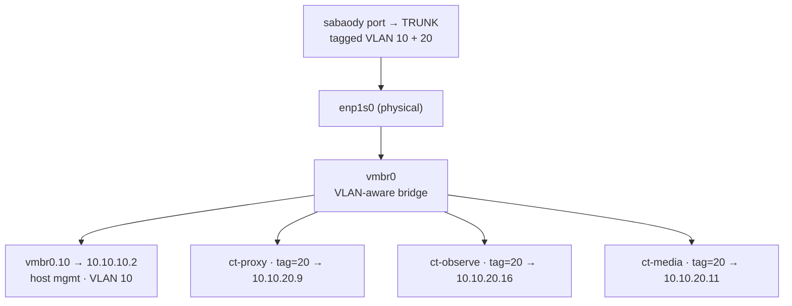

# Runbook · Proxmox + VLAN bootstrap (`poneglyph`)

First-time build of the NAS/hypervisor: install Proxmox VE 9.2, put the **host management on VLAN 10 (`10.10.10.2`)**, make guests land on **VLAN 20** via a VLAN-aware bridge, create the **`tank` ZFS mirror**, build a **hardened Docker-in-LXC base template**, and add the **VLAN 20→Mgmt monitoring exception**. Pairs with the [bare-metal restore runbook](03-proxmox-bare-metal-restore.md) (which reuses the network + ZFS steps here).



> [!IMPORTANT]
> **`poneglyph`'s switch port must be a TRUNK** (tagged VLAN 10 + 20), not an access port — the host mgmt rides VLAN 10 while guests ride VLAN 20 over the same link. Configure it on `sabaody` per [doc 02](../02-network.md) before you start.

## 1 · Install Proxmox VE 9.2
- BIOS: enable **virtualization** (AMD-V/SVM) and, for iGPU transcode later, **Above-4G decoding**.
- Boot the Proxmox VE 9.2 ISO from USB.
- **Boot disk / `rpool`:** choose the 512 GB NVMe. If you added a 2nd SSD for redundancy ([doc 04](../04-storage.md)), pick **ZFS RAID1 (mirror)** across both here — do it now; it can't be changed live without a rebuild.
- Set a **strong root password** (store it in the [break-glass](../11-security.md#break-glass--offline-credentials) copy) and a temporary management IP; we correct the VLAN networking in step 2.
- Leave the 2×4 TB IronWolf drives untouched at install — they become `tank` in step 3.

## 2 · Network: VLAN-aware bridge + host mgmt on VLAN 10

Edit `/etc/network/interfaces` (find the NIC name with `ip -br a`; `enp1s0` is illustrative):

```ini
auto lo
iface lo inet loopback

# Physical NIC — carries the tagged trunk from sabaody (no IP here)
iface enp1s0 inet manual

# VLAN-aware bridge for all guests
auto vmbr0
iface vmbr0 inet manual
    bridge-ports enp1s0
    bridge-stp off
    bridge-fd 0
    bridge-vlan-aware yes
    bridge-vids 2-4094

# Host MANAGEMENT rides VLAN 10
auto vmbr0.10
iface vmbr0.10 inet static
    address 10.10.10.2/24
    gateway 10.10.10.1        # OPNsense mgmt interface
```

Apply: `ifreload -a` (or reboot). The Proxmox web UI is now at **`https://10.10.10.2:8006`**, reachable from the Mgmt VLAN / admin workstation.

> [!NOTE]
> Guests do **not** get their VLAN from the host — each guest's NIC is tagged individually (step 5: `tag=20`). The bridge is VLAN-aware so it can carry any tag. The N5's spare 2.5 GbE NIC can later become a dedicated storage/backup link if you want.

## 3 · `tank` ZFS mirror (2×4 TB) + datasets
Always use stable `/dev/disk/by-id/` names, never `/dev/sdX`:

```bash
ls -l /dev/disk/by-id/ | grep -i ironwolf     # note the two drive IDs

zpool create -o ashift=12 tank mirror \
  /dev/disk/by-id/ata-ST4000VN006_XXXX \
  /dev/disk/by-id/ata-ST4000VN006_YYYY

zfs set compression=lz4 atime=off tank
zfs create tank/media
zfs create tank/photos
zfs create tank/docs
zfs create tank/backups
zfs create rpool/appdata          # NVMe: container configs + DBs (doc 04)
```

Cap ARC so guests get their RAM ([doc 04](../04-storage.md) — ~4 GB at 32 GB):
```bash
echo "options zfs zfs_arc_max=4294967296" > /etc/modprobe.d/zfs.conf
update-initramfs -u && reboot
```

Register storage (Datacenter → Storage, or `/etc/pve/storage.cfg`): add `tank` as a **ZFS** store for guest disks and a **Directory** store on `tank/media` etc. for bind-mounted bulk data. Schedule a **weekly scrub** (`zfs-zed` + cron) and SMART alerts.

## 4 · Hardened base LXC template (Docker-in-LXC ready)
```bash
pveam update
pveam available | grep debian-13
pveam download local debian-13-standard_*_amd64.tar.zst

# Unprivileged + nesting/keyctl so Docker runs inside the LXC (doc 03)
pct create 9000 local:vztmpl/debian-13-standard_*_amd64.tar.zst \
  --hostname base-tmpl --unprivileged 1 --features nesting=1,keyctl=1,fuse=1 \
  --cores 2 --memory 1024 --swap 512 \
  --rootfs local-zfs:8 \
  --net0 name=eth0,bridge=vmbr0,tag=20,ip=dhcp \
  --onboot 0
pct start 9000

# Harden + install Docker inside the template
pct exec 9000 -- bash -lc '
  apt-get update && apt-get -y full-upgrade &&
  apt-get -y install curl ca-certificates sudo unattended-upgrades &&
  dpkg-reconfigure -f noninteractive unattended-upgrades &&
  curl -fsSL https://get.docker.com | sh'

pct stop 9000
pct template 9000                 # freeze as a reusable template
```
- **SSH:** drop your public key into `/root/.ssh/authorized_keys` (or a `sunny` sudo user) and set `PasswordAuthentication no` before templating.
- **iGPU stacks** (`ct-media`, `ct-photos`): after cloning, pass `/dev/dri` into the container (Proxmox `dev0:` passthrough or an `lxc.mount.entry`) — see [doc 03](../03-virtualization.md).
- **FUSE (`ct-media`/Decypharr):** the `fuse=1` feature above is **required** — unprivileged LXCs block `/dev/fuse` even with `SYS_ADMIN`, so Decypharr's `rclone` mount fails without it. `fuse=1` maps the device in and inherits to every clone of this template.

## 5 · First guest on VLAN 20
```bash
pct clone 9000 209 --hostname ct-proxy
pct set 209 --net0 name=eth0,bridge=vmbr0,tag=20,ip=10.10.20.9/24,gw=10.10.20.1
pct set 209 --cores 2 --memory 1536
pct start 209
```
The guest comes up on **VLAN 20** with `10.10.20.9`, gateway `10.10.20.1` (OPNsense's Servers-VLAN interface). Repeat per stack (`ct-media` → `.11`, `ct-observe` → `.16`, …), then deploy each [`stacks/`](../../stacks/) compose.

## 6 · VLAN 20 → Mgmt monitoring exception
Because the host mgmt is on VLAN 10 but `ct-proxy`/`ct-observe` are on VLAN 20, add the **narrow pass rule** from [doc 02](../02-network.md#monitoring-and-reverse-proxy-exception-vlan-20-to-mgmt) so the `proxmox.sunny.home` route and the Homepage `siteMonitor`/Proxmox-widget checks work:

| Action | Source | Destination | Ports |
|---|---|---|---|
| Pass | `10.10.20.9`, `10.10.20.16` | `10.10.10.1` (OPNsense/AdGuard), `10.10.10.2` (Proxmox) | `443`, `3000`, `8006` |
| Block | `VLAN20 net` | `10.10.10.0/24` | any |

Without it, Proxmox/OPNsense/AdGuard show **offline** on the dashboard and `proxmox.sunny.home` times out.

## 7 · Verify
```bash
pveversion                     # 9.2-x
zpool status                   # rpool + tank both ONLINE (tank = mirror)
ip -br a show vmbr0.10         # 10.10.10.2/24
pct exec 209 -- ip -br a       # guest has 10.10.20.9
```
- Web UI at `https://10.10.10.2:8006` from the admin workstation.
- From `ct-observe` (once step 6 is in): `curl -k https://10.10.10.2:8006` succeeds; without the rule it hangs.

## Next
Deploy [`ct-proxy`](../../stacks/ct-proxy/) first (names + SSO), then the rest of [`stacks/`](../../stacks/). Set up [PBS + 3-2-1 backups](../04-storage.md) and the [external tunnel](00-tunnel-rebuild.md).
