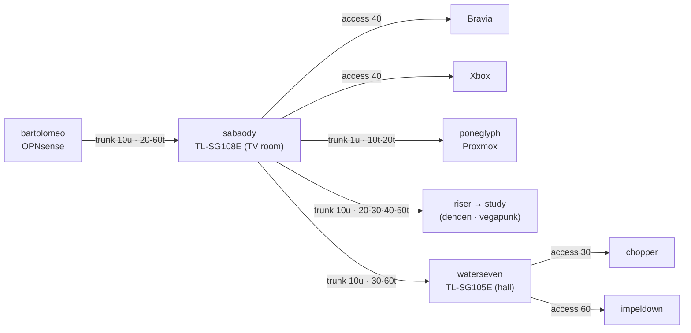

# Runbook · Switch VLANs — `sabaody` (TL-SG108E) + `waterseven` (TL-SG105E)

Exact 802.1Q port maps for both "Easy Smart" switches, the `poneglyph` VLAN 10+20 trunk, and the **untagged-VLAN-1 gotcha** procedure that trips up everyone on these models. VLAN scheme is from [doc 02](../02-network.md): `10` mgmt · `20` servers · `30` trusted · `40` IoT/TV · `50` guest · `60` sandbox · `1` unused/parking.

**Legend:** `u` = untagged member · `t` = tagged member · **PVID** = VLAN assigned to *untagged* frames arriving on that port.

## `sabaody` — TL-SG108E (8 ports, TV room)

| Port | Device | Role | PVID | Untagged | Tagged |
|---|---|---|---|---|---|
| 1 | `bartolomeo` (OPNsense LAN) | Trunk (native mgmt) | 10 | 10 | 20,30,40,50,60 |
| 2 | Sony Bravia | Access | 40 | 40 | — |
| 3 | Xbox One | Access | 40 | 40 | — |
| 4 | Riser → hall (`waterseven`) | Trunk (native mgmt) | 10 | 10 | 30,60 |
| 5 | Riser → study (`denden` / `vegapunk`) | Trunk (native mgmt) | 10 | 10 | 20,30,40,50 |
| 6 | `poneglyph` (Proxmox) | **Trunk (all-tagged)** | 1 | 1 | **10,20** |
| 7 | *(spare)* | Access | 1 | 1 | — |
| 8 | **Admin escape hatch** | Access | 1 | 1 | — |

## `waterseven` — TL-SG105E (5 ports, hall)

| Port | Device | Role | PVID | Untagged | Tagged |
|---|---|---|---|---|---|
| 1 | Uplink ← `sabaody` port 4 | Trunk (native mgmt) | 10 | 10 | 30,60 |
| 2 | `chopper` | Access | 30 | 30 | — |
| 3 | `impeldown` | Access | 60 | 60 | — |
| 4 | *(spare)* | Access | 1 | 1 | — |
| 5 | **Admin escape hatch** | Access | 1 | 1 | — |

## Why `poneglyph` is an "all-tagged" trunk (not native-mgmt)

The other trunks carry VLAN 10 **untagged** (native), because OPNsense/`waterseven` put their own management on the untagged interface. `poneglyph` is different: [runbook 04](04-proxmox-vlan-bootstrap.md) puts the Proxmox **host mgmt on `vmbr0.10` (tagged VLAN 10)** and **guests on `tag=20`** — so the host sends *everything tagged*.

- Its port is therefore **tagged in both 10 and 20**, and its native/PVID is the **dead VLAN 1**, so any stray *untagged* frame lands in the unused parking VLAN and goes nowhere (a small hardening win).
- VLAN membership — not tagging style — is what bridges traffic: `poneglyph` (tagged VLAN 10) and `bartolomeo` (untagged VLAN 10) are both members of VLAN 10, so they talk fine.
- If you'd rather match the others (native-mgmt untagged), set port 6 to PVID 10 / untagged 10 / tagged 20 **and** move the host IP from `vmbr0.10` to `vmbr0` in runbook 04. Pick one style; don't half-do it.

## The untagged-VLAN-1 gotcha — do it in THIS order

> [!WARNING]
> On the TL-SG108E/105E, **every port ships as an untagged member of VLAN 1**, PVID is set on a **separate screen** from membership, and a wrong move locks you out of the web UI. Follow the order below exactly.

1. **Prep an escape hatch.** Give your admin laptop a **static IP** in the switch's current subnet, and plan to keep **one access port on VLAN 1 / PVID 1** (ports 7–8 above) until everything verifies. Note the switch's current mgmt IP.
2. **Firmware first.** Confirm **Build 20250124 Rel.54920 or newer** (fixes CVE-2025-0729/0730 — see [doc 01](../01-fleet.md)). Update before exposing the UI.
3. **Create the VLANs.** *802.1Q VLAN* screen → add IDs **10, 20, 30, 40, 50, 60** (leave 1 as default/parking).
4. **Set membership per the tables** — add each port as **tagged** or **untagged** to the right VLANs.
5. **Remove ports from VLAN 1's untagged list** wherever they shouldn't carry it. **This is the #1 miss** — if you skip it, the port silently keeps passing VLAN 1 alongside your new VLAN, and "my VLANs don't do anything" ensues. (Leave only the true parking/escape ports in VLAN 1.)
6. **Set PVIDs** on the *802.1Q PVID Setting* screen to match the tables — membership alone does **not** change how untagged ingress is classified.
7. **Backup the config** (*System Tools → Backup/Restore*) after each switch verifies. These models have been reported to lose 802.1Q config on power-cycle on some firmware — keep an export.
8. **Management VLAN last.** Move each switch's own mgmt IP onto **VLAN 10**, done from a mgmt-VLAN port. Changing this from the wrong port is the classic lock-out — that's what the escape-hatch port is for (reset button if it still goes wrong).

## Verify
- From a **VLAN 10** admin port: both switch web UIs load; `bartolomeo`, `poneglyph` (`10.10.10.2`) reachable.
- `poneglyph`: host mgmt answers on `10.10.10.2` (VLAN 10) **and** a test guest gets a `10.10.20.x` lease (VLAN 20) — proves the all-tagged trunk works.
- `chopper` (waterseven p2) gets a `10.10.30.x` lease; `impeldown` (p3) gets `10.10.60.x` and is a dead-end ([doc 02](../02-network.md), [runbook 02](02-opnsense-wireguard.md)).
- A device on an access port sees **only** its VLAN — no VLAN 1 leakage (the gotcha check).

## Hardening
Keep both switches' management UIs on **VLAN 10 only** (never exposed to trusted/IoT/guest), given this model's credential-in-URL and clickjacking CVE history ([doc 02](../02-network.md)).
