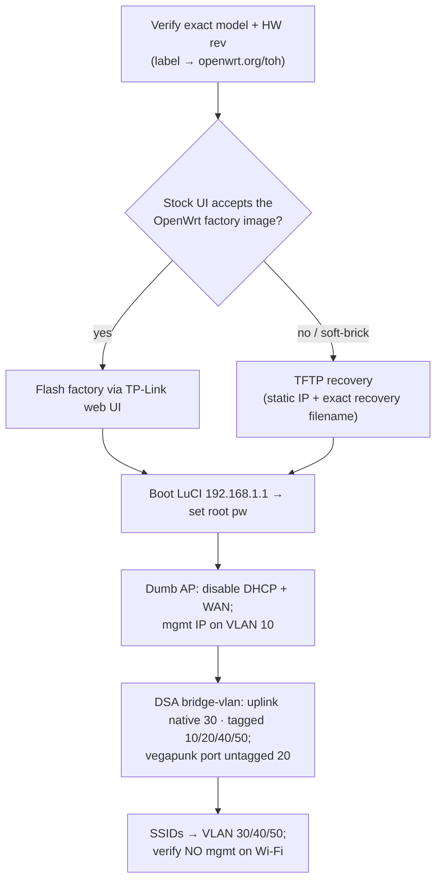

# Runbook · Flash `denden` (Archer AC1750) to OpenWrt as a VLAN-aware dumb AP

This is **Option A** from [the denden AP trunk trap](05-switch-vlan-config.md#the-denden-ap-trunk-trap): make the first-floor AP genuinely 802.1Q-aware so upstairs Wi-Fi lands on the right VLANs and `vegapunk` gets its VLAN-20 tags. End state: `denden` is a **dumb AP** (no routing/DHCP) whose uplink matches [`sabaody` port 5](05-switch-vlan-config.md) — **native VLAN 30, tagged 10/20/40/50**.

> [!WARNING]
> **Flashing can brick the device. Verify the EXACT model + hardware revision first.** "Archer AC1750" is a marketing name shared by several models (Archer C7 v2–v5, A7 v5, …), and **OpenWrt images are hardware-revision-specific** — the wrong image bricks it. Read the sticker on the underside (e.g. "Archer C7 v5.0") and match it on the OpenWrt **Table of Hardware** before downloading anything. This voids the TP-Link warranty.



## 0 · Prerequisites
- **Confirm model/rev** on the label → find its page at [openwrt.org/toh/start](https://openwrt.org/toh/start). Note the exact **factory** and **sysupgrade** image filenames and any device-specific warnings.
- A **wired** laptop, a spare Ethernet cable, and **~30 min with the AP off the network** (do this before it's load-bearing).
- **Back up** the current TP-Link config and download the matching **stock firmware** from tp-link.com (your rollback path).
- Install a **TFTP server** (e.g. `tftpd-hpa`) on the laptop for the recovery path.
- Use the **current stable OpenWrt** release listed for your model (verify the version on its ToH page).

## 1 · Flash — web UI first
1. Download the OpenWrt **factory** image for your exact model/rev; verify its `sha256sum` against the OpenWrt page.
2. On stock firmware: **System Tools → Firmware Upgrade** → select the OpenWrt *factory* image → upgrade. Don't power off mid-flash.
3. If the stock UI **rejects** it (some regional TP-Link firmware refuses non-TP-Link images) → use TFTP recovery (next).

## 2 · Flash — TFTP recovery fallback
Model-specific but the shape is constant (values below are typical for Archer C7/A7 — **confirm on your device's page**):
1. Laptop NIC → static **`192.168.0.66/24`**, cable into a **LAN** port.
2. Put the OpenWrt **factory** image in the TFTP root, **renamed to the exact file the bootloader requests** — e.g. `ArcherC7v5_tp_recovery.bin` (C7 v5) or `ArcherA7v5_tp_recovery.bin` (A7 v5).
3. Start `tftpd-hpa`. Power the AP **off**, hold **Reset**, power **on** while holding ~10–15 s until it pulls the file and flashes.
4. It reboots into OpenWrt.

## 3 · First boot
- Connect to a LAN port; browse to **`http://192.168.1.1`** (LuCI).
- Set a strong **root password** (also store it in the [break-glass](../11-security.md#break-glass--offline-credentials) copy — this AP will sit on the mgmt VLAN).
- Optional: `opkg update` and confirm LuCI + wireless packages are present (factory images include them).

## 4 · Convert to a dumb AP
`denden` only **bridges** — OPNsense does all routing/DHCP/firewalling.
- **Disable DHCP server** on every interface (OPNsense is the per-VLAN DHCP authority).
- **Disable the firewall** service (a pure bridge doesn't route): `service firewall disable`.
- **Don't use the WAN** port/interface — leave it out of the bridge.
- Point the AP's **own** gateway/DNS at OPNsense mgmt (`10.10.10.1`) so it can fetch updates.

## 5 · DSA VLAN config (match `sabaody` port 5)

> [!NOTE]
> Recent OpenWrt uses **DSA** on most supported Archers; a few older ath79 builds still use **swconfig**. The UCI below is DSA — **verify port names** with `ip link` / your model's page. If yours is swconfig, configure the equivalent under `config switch_vlan` instead. Uplink here = `lan1`, `vegapunk` = `lan2` (adjust to your wiring).

`/etc/config/network` (bridge + VLAN filtering + the interfaces):
```uci
config device
    option name 'br-lan'
    option type 'bridge'
    list ports 'lan1'          # uplink → sabaody port 5 (trunk)
    list ports 'lan2'          # vegapunk (access, VLAN 20)
    option vlan_filtering '1'

# VLAN membership — uplink is native/untagged 30, tagged 10/20/40/50 (matches runbook 05)
config bridge-vlan
    option device 'br-lan'
    option vlan '30'
    list ports 'lan1:u*'       # u* = untagged + PVID  → native Trusted
config bridge-vlan
    option device 'br-lan'
    option vlan '10'
    list ports 'lan1:t'        # mgmt, tagged only
config bridge-vlan
    option device 'br-lan'
    option vlan '20'
    list ports 'lan1:t'
    list ports 'lan2:u*'       # vegapunk access port = untagged VLAN 20
config bridge-vlan
    option device 'br-lan'
    option vlan '40'
    list ports 'lan1:t'        # IoT SSID
config bridge-vlan
    option device 'br-lan'
    option vlan '50'
    list ports 'lan1:t'        # Guest SSID

# AP management lives on VLAN 10
config interface 'mgmt'
    option device 'br-lan.10'
    option proto 'static'
    option ipaddr '10.10.10.3'
    option netmask '255.255.255.0'
    option gateway '10.10.10.1'
    list dns '10.10.10.1'

# SSID-carrying VLANs — bridged only, no IP on the AP
config interface 'servers'
    option device 'br-lan.20'
    option proto 'none'
config interface 'trusted'
    option device 'br-lan.30'
    option proto 'none'
config interface 'iot'
    option device 'br-lan.40'
    option proto 'none'
config interface 'guest'
    option device 'br-lan.50'
    option proto 'none'
```

`/etc/config/wireless` — map each SSID to a VLAN (multi-SSID per radio; keys are placeholders, never commit real ones):
```uci
config wifi-iface
    option device 'radio0'          # 5 GHz
    option mode 'ap'
    option network 'trusted'
    option ssid 'ThousandSunny'
    option encryption 'sae-mixed'   # WPA2/WPA3
    option key 'REPLACE_TRUSTED_PSK'

config wifi-iface
    option device 'radio1'          # 2.4 GHz
    option mode 'ap'
    option network 'iot'
    option ssid 'ThousandSunny-IoT'
    option encryption 'psk2'
    option key 'REPLACE_IOT_PSK'

config wifi-iface
    option device 'radio0'
    option mode 'ap'
    option network 'guest'
    option ssid 'ThousandSunny-Guest'
    option encryption 'sae-mixed'
    option key 'REPLACE_GUEST_PSK'
    option isolate '1'              # guest client isolation
```
Apply: `uci commit && reload_config` (or reboot). Disable DHCP on these interfaces in `/etc/config/dhcp` (`option ignore '1'` per interface) if not already off.

## 6 · Verify (the trap check)
- AP mgmt reachable at **`10.10.10.3`** (VLAN 10) from the mgmt VLAN — and **not** from any Wi-Fi SSID.
- Join **ThousandSunny** → get a `10.10.30.x` lease (Trusted). **IoT** SSID → `10.10.40.x`. **Guest** → `10.10.50.x`, isolated.
- `vegapunk` (wired to `lan2`) → `10.10.20.x` (Servers) and can reach the LLM endpoint.
- **Critical:** confirm **no SSID lands on VLAN 10** — join each SSID and verify you *cannot* reach `10.10.10.2:8006` (Proxmox) or the OPNsense mgmt UI. That's the whole point of the fix.

## 7 · Recovery / rollback
- **Bad config, still boots:** OpenWrt **failsafe** — power-cycle, press the reset button when the LED flashes, `telnet 192.168.1.1`, then `mount_root` and fix `/etc/config/*` (or `firstboot && reboot` to reset).
- **Soft-brick:** repeat the **TFTP recovery** (step 2) with either an OpenWrt image or the **stock TP-Link firmware** (renamed to the recovery filename) to return to factory.
- Keep the **stock firmware** file and a LuCI **config backup** (`System → Backup`) off-device.

## Cross-refs
Targets and rationale: [runbook 05 · denden trap](05-switch-vlan-config.md#the-denden-ap-trunk-trap) · fleet note: [doc 01 `denden`](../01-fleet.md) · VLAN scheme: [doc 02](../02-network.md).
