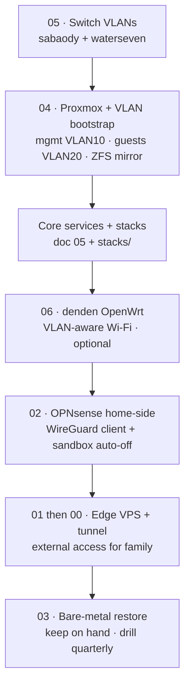

# Runbooks

Step-by-step operational guides for building, recovering, and maintaining **Thousand Sunny**. Each is self-contained and cross-links the relevant [architecture docs](../). Diagrams render inline (Mermaid); every file is CI-validated.

## Index

| # | Runbook | What it does |
|---|---|---|
| 00 | [Tunnel rebuild](00-tunnel-rebuild.md) | Rebuild the `puffingtom` edge tunnel on any VPS in ~15 min (CGNAT-bypass). |
| 01 | [VPS provider notes](01-provider-notes.md) | Oracle / RackNerd / Hetzner / Netcup / IONOS specifics + gotchas for the edge node. |
| 02 | [OPNsense home-side](02-opnsense-wireguard.md) | WireGuard client, narrow tunnel→Jellyfin rule, VLAN-60 sandbox + 1-hour auto-off, Servers routing. |
| 03 | [Proxmox bare-metal restore](03-proxmox-bare-metal-restore.md) | Recover `poneglyph` from a dead boot drive (RTO ~1–3 h). |
| 04 | [Proxmox + VLAN bootstrap](04-proxmox-vlan-bootstrap.md) | First-time build: VLAN-aware bridge (mgmt VLAN 10, guests VLAN 20), ZFS mirror, hardened LXC template. |
| 05 | [Switch VLAN config](05-switch-vlan-config.md) | `sabaody` (TL-SG108E) + `waterseven` (TL-SG105E) 802.1Q port maps + the untagged-VLAN-1 gotcha. |
| 06 | [denden → OpenWrt](06-denden-openwrt.md) | Flash the Archer AC1750 to OpenWrt as a VLAN-aware dumb AP. |

## Recommended build order

Runbooks are numbered by topic, not sequence — build in this order:

1. **Lay the network fabric** — [05 · Switch VLANs](05-switch-vlan-config.md): create the VLANs and trunk/access ports on `sabaody` (and `waterseven` in the hall). Everything rides on this.
2. **Stand up the hypervisor** — [04 · Proxmox bootstrap](04-proxmox-vlan-bootstrap.md): install Proxmox on `poneglyph` with host mgmt on VLAN 10, guests on VLAN 20, the ZFS mirror, and the base Docker-in-LXC template.
3. **Core services + app stacks** — follow [doc 05](../05-core-services.md) (OPNsense, AdGuard/Unbound, Caddy, Authelia, Vaultwarden, CrowdSec) and deploy the [`stacks/`](../../stacks/) compose files.
4. **Upstairs Wi-Fi (optional)** — [06 · denden OpenWrt](06-denden-openwrt.md) if you're making the AP VLAN-aware.
5. **Home firewall + sandbox** — [02 · OPNsense home-side](02-opnsense-wireguard.md): the WireGuard client interface, the narrow tunnel→Jellyfin rule, and the VLAN-60 sandbox with auto-off.
6. **External access** — [01 · provider notes](01-provider-notes.md) to pick/spin the edge VPS, then [00 · tunnel rebuild](00-tunnel-rebuild.md) to bring up the CGNAT-bypass tunnel for family.
7. **Recovery (ongoing)** — keep [03 · bare-metal restore](03-proxmox-bare-metal-restore.md) on hand and dry-run it quarterly.

> New here? Start with the [project README](../../README.md) and the [architecture overview](../00-overview.md), then build top-to-bottom.
